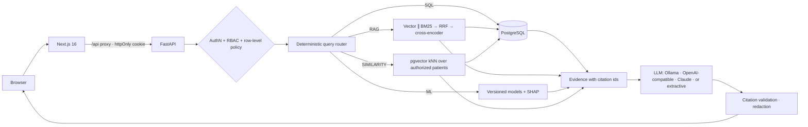

# CareFlow AI

**Intelligent hospital management, predictive analytics and clinical knowledge platform** — a full-stack
AI/ML portfolio project in which every AI answer is built only from data the signed-in user is allowed
to see.

> **Synthetic data only.** Every patient, clinician and hospital document is fictional. The models are
> trained on a public de-identified dataset. CareFlow AI provides retrieval, summaries, predictions and
> explanations as decision support — it does not diagnose or choose treatments, and it is not for clinical use.

| Subsystem | Responsibility |
|---|---|
| **PostgreSQL 16 + pgvector** | Source of truth for structured hospital data; vector index for document chunks and patient-similarity vectors |
| **Machine learning** | 30-day readmission risk (calibrated random forest + SHAP), length-of-stay regression (XGBoost), patient similarity |
| **RAG** | Structure-aware ingestion, hybrid semantic + BM25 retrieval, RRF fusion, cross-encoder reranking, verifiable citations |
| **LLM** | Natural-language interaction and synthesis over authorized evidence; tool calling for unusual questions |
| **Access policy** | RBAC + row-level SQL predicates applied *before* anything reaches the AI layer |



Detailed design: [`docs/architecture.md`](docs/architecture.md) · [`docs/ml.md`](docs/ml.md) ·
[`docs/rag.md`](docs/rag.md) · [`docs/security.md`](docs/security.md) · [`docs/demo.md`](docs/demo.md) ·
[`docs/interview-preparation.md`](docs/interview-preparation.md)

---

## Features

**Hospital operations** — patients (registration, demographics, allergies, care team), clinician
registration (admin registers the doctor profile; the login account is created separately and linked to
it), doctors and availability, appointment booking with availability and double-booking checks, admissions/discharges,
medical records, prescriptions (formulary, high-alert flags, allergy check, discontinue with reason),
laboratory results with reference ranges and critical flags, knowledge-base document management
(upload → processing → indexed/failed, versioning, chunk inspection).

**AI & ML**
* **AI assistant** answering, with citations, questions such as *"Summarize this patient's history"*,
  *"What does our diabetes guideline say about monitoring?"*, *"Why is this patient's readmission risk
  high?"*, *"Compare this patient's treatment with our diabetes guideline"*, *"Find similar patients"*.
* **Patient timeline** generated chronologically from structured records, every event linked to its source row.
* **Readmission risk** with calibrated probability, risk band, alert threshold and SHAP factor attributions.
* **Length of stay** estimate with an empirical 80 % interval and the actual stay for comparison.
* **Patient similarity** restricted to authorized patients, with descriptive cohort patterns.
* **ML analytics** page: model cards, ROC/PR/calibration curves, confusion matrix, candidates, leakage
  ablations, RAG and similarity evaluation results.

**Security & operations** — Argon2id, JWT in an httpOnly SameSite cookie + CSRF header, login rate
limiting, RBAC + row-level access, authorization-aware retrieval, prompt-injection quarantine, citation
validation, safe error envelopes, audit log (no clinical text), AI query traces, Prometheus metrics,
Docker Compose.

## Technology (and why)

| Layer | Choice | Purpose |
|---|---|---|
| Frontend | Next.js 16 (App Router), TypeScript, Tailwind CSS v4, lucide icons | Enterprise UI; `/api` rewrite gives same-origin cookie auth; `proxy.ts` redirects anonymous users |
| Backend | FastAPI, Pydantic v2, SQLAlchemy 2, Alembic, psycopg 3 | Typed API, validation, migrations |
| Database | PostgreSQL 16 + pgvector (HNSW) | One transactional store for records, vectors and access predicates |
| ML | pandas, scikit-learn, XGBoost, SHAP | Training, calibration, explanations |
| Retrieval | fastembed (ONNX): `bge-small-en-v1.5` embeddings, `ms-marco-MiniLM-L-6-v2` cross-encoder; custom BM25 | Hybrid search + reranking without a PyTorch dependency |
| LLM | Provider abstraction: Ollama/OpenAI-compatible (httpx), Anthropic (official SDK, Claude Opus 5 default), extractive fallback | Swap providers by configuration |
| Parsing | pypdf, python-docx | PDF/TXT/MD/DOCX ingestion |
| Observability | JSON logs, Prometheus client, trace table | Latency per AI stage, tokens, errors |
| Tests | pytest (133 tests, real PostgreSQL), Vitest + Testing Library (13 tests) | |
| Packaging | uv, npm, Docker Compose (3 services) | |

No separate vector database, queue or cache: they were not needed at this scale (see
[architecture decisions](docs/architecture.md#6-key-design-decisions)).

---

## Quick start (Docker)

```bash
cp .env.example .env
```

Edit `.env`: set `CAREFLOW_JWT_SECRET` (e.g. `python -c "import secrets; print(secrets.token_urlsafe(48))"`)
and `POSTGRES_PASSWORD`. Optionally choose an LLM provider (below). Then:

```bash
docker compose up --build
```

The backend container runs migrations, seeds the synthetic hospital and knowledge base on first start
(idempotent), and serves the API. Open **http://localhost:3000** (API docs: http://localhost:8000/docs).

Demo accounts — password `CareFlow-Demo-2026` (or your `CAREFLOW_DEMO_PASSWORD`):

| Email | Role |
|---|---|
| `admin@careflow.demo` | Administrator |
| `dr.rao@careflow.demo` | Doctor — General Medicine (demo patient **P1024** is hers) |
| `dr.mensah@careflow.demo` | Doctor — Cardiology |
| `nurse.kim@careflow.demo` | Nurse — assigned ward patients |
| `reception@careflow.demo` | Reception — demographics and scheduling |

## Local development (no Docker)

Prerequisites: [uv](https://docs.astral.sh/uv/), Node.js 20+ (24 used), optionally [Ollama](https://ollama.com).

```bash
uv sync --project backend --python 3.12
```

Start PostgreSQL 16 + pgvector from the bundled binaries (port 5433; creates `careflow` and `careflow_test`):

```bash
uv run --project backend python scripts/local_postgres.py start
```

Create `backend/.env` from `.env.example` (set `CAREFLOW_JWT_SECRET`; the default database URL already
points at port 5433), then migrate and seed:

```bash
cd backend && uv run alembic upgrade head && uv run python -m app.seed --with-documents
```

Run the API (use `python -m uvicorn` — some Windows policies block the `uvicorn.exe` shim):

```bash
cd backend && uv run python -m uvicorn app.main:app --port 8000 --reload --reload-dir app
```

Run the frontend in a second terminal:

```bash
cd frontend && npm install && npm run dev
```

### Choosing the LLM provider

| `CAREFLOW_LLM_PROVIDER` | Settings | Notes |
|---|---|---|
| `groq` (recommended for hosting) | `GROQ_API_KEY`; model `CAREFLOW_GROQ_MODEL` (default `openai/gpt-oss-120b`, `reasoning_effort=low`), then `CAREFLOW_GROQ_FALLBACK_MODELS` (default `qwen/qwen3.8-27b,openai/gpt-oss-20b`) | Groq cloud, free tier, answers in 2–5 s. Tool calling supported. Each Groq model has its own 8K tokens/minute free allowance (a patient summary uses ~5K), so the chain multiplies capacity |
| `gemini` | `GEMINI_API_KEY`; model `CAREFLOW_GEMINI_MODEL` (default `gemini-2.5-flash`, a free-tier model; thinking off) | Google's OpenAI-compatible endpoint. Best used as the backup |
| `extractive` (default) | — | No LLM. Grounded answers assembled from records and cross-encoder-selected passages; always available, cannot hallucinate, cannot reason/compare |
| `openai_compatible` | `CAREFLOW_LLM_MODEL=gemma4:12b` (or `llama3`, …), `CAREFLOW_LLM_BASE_URL=http://localhost:11434/v1`, optional `CAREFLOW_LLM_REASONING_EFFORT=none` | Ollama, vLLM, LM Studio, OpenAI. Tool calling supported. On a CPU-only machine answers take minutes; set `CAREFLOW_LLM_TIMEOUT_SECONDS` accordingly |
| `anthropic` | `ANTHROPIC_API_KEY` (or `CAREFLOW_ANTHROPIC_API_KEY`); model defaults to `claude-opus-5` | Official SDK, adaptive thinking, server-side refusal fallbacks enabled (`CAREFLOW_ANTHROPIC_REFUSAL_FALLBACKS=false` to disable) |

**Backup models.** Requests go to the Groq models in order, then to Gemini
(`CAREFLOW_LLM_FALLBACK_PROVIDER=gemini`). The same request moves to the next model whenever one fails (HTTP 429 rate limit, 5xx, rejected or missing key, or no reply within
`CAREFLOW_GROQ_TIMEOUT_SECONDS`, default 20 s). The switch is silent to the user; the trace records which
provider answered and the server logs the reason. The primary is then skipped for
`CAREFLOW_LLM_FALLBACK_COOLDOWN_SECONDS` (30 s) so a rate-limited free tier isn't retried on every call.
If the backup also fails, the assistant returns the extractive answer with a warning. The Assistant page's
Configuration card shows both providers and whether each key is accepted (checked by listing models,
which spends no tokens).

Recommended hosted setup, set as environment variables on the **backend** host (Render/Railway/Fly),
never in Vercel or the frontend and never committed:

```env
CAREFLOW_LLM_PROVIDER=groq
GROQ_API_KEY=<your Groq key>
CAREFLOW_LLM_FALLBACK_PROVIDER=gemini
GEMINI_API_KEY=<your Gemini key>
CAREFLOW_LLM_TOOL_CALLING=auto
```

Free-tier limits are per account and change over time (check the Groq and Google AI Studio consoles);
the context budget below keeps a typical prompt around 3k tokens.

`CAREFLOW_LLM_TOOL_CALLING` controls questions the router cannot classify: `auto` (default) lets the LLM
choose tools over several calls, which suits fast providers such as Claude; `off` always uses the router's
plan and a single LLM call — set this for local CPU models, where each extra call costs minutes.

Measured on the development laptop (Intel Core Ultra 5, CPU-only inference through Ollama), for
*"What does our diabetes guideline say about monitoring?"*: `gemma4:12b` with thinking disabled
(`CAREFLOW_LLM_REASONING_EFFORT=none`) answered in **143 s** with five correct section citations;
`llama3:8b` in **80 s** with correct citations but weaker structure. With thinking enabled, gemma4
exceeded a 120 s timeout. Evidence is trimmed to `CAREFLOW_LLM_CONTEXT_BUDGET_CHARS` (default 12,000)
because Ollama's default 4k-token window silently truncates longer prompts, which could drop the system rules.

### Windows note: blocked native extensions

Some locked-down Windows hosts (Application Control / Smart App Control) block compiled Python
extensions — `lxml` (used by python-docx) and `mmh3` (used by fastembed) are the ones that hit this
project. `.docx` ingestion and the real embedding/reranker models then fail with
*"An Application Control policy has blocked this file"*. The test suite detects this and skips those
two tests instead of failing; Docker and Linux hosts are unaffected. To run the full stack locally,
allow those DLLs in the Windows security policy.

## Testing & evaluation

Backend tests run against a real PostgreSQL test database with a seeded mini-hospital (133 tests: auth,
RBAC/row-level access, patients, appointments, clinical writes, documents/ingestion, ML, RAG, routing,
prompt injection, AI integration for SQL / RAG / ML / SQL+RAG / SQL+ML / SQL+RAG+ML / similarity):

```bash
cd backend && uv run python -m pytest -m "not models and not llm"
```

Tests that use the downloaded embedding/reranker models:

```bash
cd backend && uv run python -m pytest -m models
```

Frontend unit tests and type checking:

```bash
cd frontend && npm test && npm run typecheck
```

RAG benchmark (vector vs BM25 vs hybrid vs hybrid + rerank) and similarity validation, against the seeded dev database:

```bash
uv run --project backend python -m rag.evaluation.run_eval
```

```bash
uv run --project backend python -m ml.evaluation.evaluate_similarity
```

Retrain the models (downloads the UCI dataset first):

```bash
uv run --project backend python -m ml.data.download
```

```bash
uv run --project backend python -m ml.training.train_readmission --version 1.0.1
```

## Results (all generated by the scripts; see `ml/evaluation/reports`, `rag/evaluation/results`)

**Readmission (UCI Diabetes 130-US, patient-grouped test split, n = 15,108, prevalence 0.120)**

| ROC-AUC | PR-AUC | Precision | Recall | F1 | Brier |
|---|---|---|---|---|---|
| 0.685 | 0.242 | 0.237 | 0.427 | 0.305 | 0.0995 |

Random forest selected on validation PR-AUC over logistic regression and XGBoost (weighted and
unweighted); isotonic calibration; threshold 0.149 chosen on validation. Moderate discrimination,
consistent with the literature for this dataset.

**Length of stay (predicted at admission)** — MAE 2.25 days (median baseline 2.28), RMSE 2.88, R² 0.078;
80 % interval coverage 79.9 %. A leakage ablation with stay-time features reaches R² 0.413, which is why
those features are excluded.

**RAG (48 questions, top-6 context)**

| Mode | Recall@1 | Recall@5 | MRR | Context precision | Abstention | p50 latency |
|---|---|---|---|---|---|---|
| Vector | 0.932 | 1.000 | 0.958 | 0.614 | 0.75 | 44 ms |
| BM25 | 0.841 | 0.955 | 0.890 | 0.553 | 1.00 | 6 ms |
| Hybrid | 0.909 | 1.000 | 0.945 | 0.621 | 0.75 | 36 ms |
| **Hybrid + rerank** | **0.955** | **1.000** | **0.977** | **0.835** | **1.00** | 865 ms |

**Patient similarity** — neighbours share the patient's department 87 % of the time (random 31 %) and
diagnosis groups with Jaccard 0.91 (random 0.35).

Interpretation and caveats: [`docs/ml.md`](docs/ml.md), [`docs/rag.md`](docs/rag.md).

## Repository layout

```
backend/        FastAPI app (app/), Alembic migration, 133 tests, Dockerfile
frontend/       Next.js app (app/, components/, lib/), Vitest tests, Dockerfile
ml/             UCI preprocessing, training, evaluation reports, versioned artifacts
rag/            synthetic knowledge base (source → dist), benchmark and evaluation runner
scripts/        local PostgreSQL helper, demo-corpus builder
docs/           architecture, ML, RAG, security, demo script, interview guide
docker-compose.yml · .env.example
```

## Known limitations

* The readmission and LOS models come from 1999–2008 US diabetic encounters; the serving population is synthetic, so outputs demonstrate the pipeline, not clinical validity. No subgroup fairness audit yet.
* A local LLM on CPU is slow (minutes per answer); use a GPU, a smaller model, or the Anthropic provider for interactive use.
* Ingestion runs in-process (FastAPI background tasks); no OCR for scanned PDFs; BM25 index is per process.
* Security gaps are listed in [`docs/security.md`](docs/security.md#10-known-gaps-deliberately-out-of-scope) (no MFA/SSO, per-process rate limiting, unauthenticated `/metrics`).
* The Docker Compose configuration was written for, but not executed in, the development environment (Docker was unavailable there); the same steps — migrations, seeding, uvicorn, `next build` — were validated natively.

## Future improvements

Clinician-labelled evaluation and LLM-as-judge faithfulness scoring · streaming responses and prompt
caching · job queue for ingestion and batch scoring · model drift monitoring and fairness analysis ·
MLflow model registry · OCR · SSO/MFA and break-glass access · search engine for BM25 at scale.

## Data & licences

* Training data: *Diabetes 130-US Hospitals for Years 1999–2008*, Strack et al. (2014), UCI Machine Learning Repository, DOI 10.24432/C5230J, **CC BY 4.0**. Not redistributed here; download with `ml.data.download`.
* All patients, staff, the hospital and its documents are synthetic and fictional; the guideline documents are *not* real clinical guidance.
