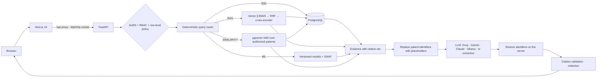

# CareFlow AI

**Intelligent hospital management, predictive analytics and clinical knowledge platform** — a full-stack
AI/ML portfolio project in which every AI answer is built only from data the signed-in user is allowed
to see.

> **Synthetic data only.** Every patient, clinician and hospital document is fictional. The models are
> trained on a public de-identified dataset. CareFlow AI provides retrieval, summaries, predictions and
> explanations as decision support — it does not diagnose or choose treatments, and it is not for clinical use.

| Subsystem | Responsibility |
|---|---|
| **PostgreSQL 16 + pgvector** | Source of truth for structured hospital data; vector index for document chunks and patient-similarity vectors |
| **Machine learning** | 30-day readmission risk (calibrated random forest + SHAP), length-of-stay regression (XGBoost), patient similarity |
| **RAG** | Structure-aware ingestion, hybrid semantic + BM25 retrieval, RRF fusion, cross-encoder reranking, verifiable citations |
| **LLM** | Natural-language interaction and synthesis over authorized evidence; tool calling for unusual questions |
| **Access policy** | RBAC + row-level SQL predicates applied *before* anything reaches the AI layer |
| **Privacy gateway** | Patient identifiers replaced with placeholders before a prompt leaves the network, restored in the answer |
| **Interoperability** | Read-only FHIR R4 export of a patient's record (ICD-10-CM, LOINC, UCUM, WHO ATC, SNOMED CT) |
| **Early warning** | Bedside observations scored with NEWS2, the hospital's escalation rules, and a live ward board |
| **Medical imaging** | DICOM studies de-identified on ingest, a film viewer, and chest radiograph triage that orders the reading queue |



Detailed design: [`docs/architecture.md`](docs/architecture.md) · [`docs/ml.md`](docs/ml.md) ·
[`docs/rag.md`](docs/rag.md) · [`docs/security.md`](docs/security.md) · [`docs/demo.md`](docs/demo.md) ·
[`docs/interview-preparation.md`](docs/interview-preparation.md)

---

## Features

**Hospital operations** — patients (registration, demographics, allergies, care team), clinician
registration (admin registers the doctor profile; the login account is created separately and linked to
it), doctors and availability, appointment booking with availability and double-booking checks, admissions/discharges,
medical records, prescriptions (formulary, high-alert flags, allergy check, discontinue with reason),
laboratory results with reference ranges and critical flags, knowledge-base document management
(upload → processing → indexed/failed, versioning, chunk inspection).

**AI & ML**
* **AI assistant** answering, with citations, questions such as *"Summarize this patient's history"*,
  *"What does our diabetes guideline say about monitoring?"*, *"Why is this patient's readmission risk
  high?"*, *"Compare this patient's treatment with our diabetes guideline"*, *"Find similar patients"*.
* **Patient timeline** generated chronologically from structured records, every event linked to its source row.
* **Readmission risk** with calibrated probability, risk band, alert threshold and SHAP factor attributions.
* **Length of stay** estimate with an empirical 80 % interval and the actual stay for comparison.
* **Patient similarity** restricted to authorized patients, with descriptive cohort patterns.
* **ML analytics** page: model cards, ROC/PR/calibration curves, confusion matrix, candidates, leakage
  ablations, RAG and similarity evaluation results.

**Discharge co-pilot** — on "Prepare discharge" the system assembles a complete draft summary and the
clinician reviews, edits and signs it. The split is deliberate: *the record* supplies the medication
reconciliation (admission list vs inpatient orders vs discharge list, with the reason for every change),
the diagnoses, the results and the booked follow-up; *the discharge policy* supplies the readmission-risk
screening and transitional-care checks, each linked to the policy section it implements; *the model*
supplies the readmission estimate, which is one of the policy's screening criteria; and the language model
writes only the prose — sentence by sentence, with a source for each, flagged when a sentence has no valid
source or contains a number that is not in the records it cites. Nothing reaches the medical record until a
clinician signs, a flagged sentence left unchanged has to be confirmed, and the signed note keeps its source
markers plus a provenance record (which model drafted it, who signed it, how much they changed).

**Bedside observations and early warning** — nurses record observations; the server scores them with
**NEWS2** (Royal College of Physicians, 2017) and applies the hospital's own escalation rules (the Patient
Safety Guidelines' rapid-response criteria), citing the policy section for each. The *Inpatients* board
lists everyone in hospital worst-score-first, shows which parameter contributed which points, and marks
observations that are overdue for the frequency the score itself requires. The board updates live over
server-sent events as observations are recorded, and falls back to a periodic refresh. NEWS2 is validated
for adults, so for a patient under 16 the values are recorded but no risk band is shown.

**Radiology** — DICOM studies are **de-identified as they are ingested** (PS3.15 Basic Profile: identifying
tags removed or emptied, private tags dropped, dates shifted by a per-patient offset, new study identifiers
minted), so the file on disk carries nothing from wherever it came from and the link to a patient lives in
the database under the usual access policy. The record keeps the real acquisition date; the file does not.
A **triage model** scores frontal chest films — eight findings that met a stated publication bar on a
held-out, patient-disjoint test set — and orders the reading queue by the probability that a film shows
anything at all. The viewer is a real one: window and level by dragging, zoom, pan, invert, and the model's
attention as an exact class activation map rather than an approximation. Every finding is shown with its
cut-off, the base rate, its ROC-AUC with a bootstrap interval, and what the cut-off catches and clears, so
a reader can weigh a flag instead of trusting it. The **radiologist writes the report** — the model writes
none of it — and signing puts it in the medical record with a provenance note of what the model had
flagged and whether the reader agreed.

**Interoperability** — a patient's whole record exports as a **FHIR R4** Bundle
(`GET /fhir/Patient/{mrn}/$everything`), coded with ICD-10-CM, LOINC, UCUM, WHO ATC and SNOMED CT routes,
under the same row-level access policy, with a `CapabilityStatement` at `/fhir/metadata` and FHIR
`OperationOutcome` errors. Radiology exports as `ImagingStudy` (DICOM UIDs, SNOMED CT body site), the signed
report as a `DiagnosticReport`, and the triage output as a `RiskAssessment` with one prediction per finding.
Summaries drafted by the co-pilot carry a FHIR `Provenance` naming the clinician as author and the model as
an assembler `Device`; a radiology report's `Provenance` names only the clinician, with the model's
assessment as a source they consulted — so a receiving system can tell what a machine wrote and what it
merely showed.

**Security & operations** — Argon2id, JWT in an httpOnly SameSite cookie + CSRF header, login rate
limiting, RBAC + row-level access (administration is separated from clinical authoring; care-team
assignments, doctor profiles and account/profile links are maintained from the UI with their invariants
enforced server-side), authorization-aware retrieval, prompt-injection quarantine, citation
validation, safe error envelopes, audit log (no clinical text), AI query traces, Prometheus metrics,
Docker Compose.

**Privacy of prompts** — before a question goes to a model hosted outside this network it goes through
three passes: every direct identifier of the patients in the evidence (name, MRN, date of birth, phone,
e-mail, address, emergency contact) is replaced with a placeholder such as `PATIENT_1`; phone, e-mail, MRN
and ID *shapes* the database does not hold are caught by pattern; and a **named-entity model** masks the
people nobody ever issued an identifier for — a relative in a note, a clinician at another hospital — as
`PERSON_1`. The answer and the model's tool arguments are mapped back on the server, so a tool called with
`MRN_1` still runs under the real access policy. Each answer can show exactly what the provider received.
Set with `CAREFLOW_LLM_PSEUDONYMIZE` (`auto` — cloud models only, the default; `on`; `off`) and
`CAREFLOW_PRIVACY_NER` (the third pass; on by default).

## Technology (and why)

| Layer | Choice | Purpose |
|---|---|---|
| Frontend | Next.js 16 (App Router), TypeScript, Tailwind CSS v4, lucide icons | Enterprise UI; `/api` rewrite gives same-origin cookie auth; `proxy.ts` redirects anonymous users |
| Backend | FastAPI, Pydantic v2, SQLAlchemy 2, Alembic, psycopg 3 | Typed API, validation, migrations |
| Database | PostgreSQL 16 + pgvector (HNSW) | One transactional store for records, vectors and access predicates |
| ML | pandas, scikit-learn, XGBoost, SHAP | Training, calibration, explanations |
| Imaging | pydicom (read, de-identify, render), ONNX Runtime + a frozen ResNet-50, scikit-learn heads | DICOM handling and chest radiograph triage with an exact activation map |
| Privacy | Dictionary vault + shape patterns, then an ONNX BERT tagger (`Xenova/bert-base-NER`) | Identifiers replaced before a prompt leaves the network, restored on the server |
| Retrieval | fastembed (ONNX): `bge-small-en-v1.5` embeddings, `ms-marco-MiniLM-L-6-v2` cross-encoder; custom BM25 | Hybrid search + reranking |
| Model runtime | ONNX Runtime for all four neural models (embeddings, reranker, image backbone, name tagger) | No PyTorch anywhere: smaller image, faster cold start, CPU-only serving |
| LLM | Provider abstraction: Ollama/OpenAI-compatible (httpx), Anthropic (official SDK, Claude Opus 5 default), extractive fallback | Swap providers by configuration |
| Parsing | pypdf, python-docx | PDF/TXT/MD/DOCX ingestion |
| Interoperability | HL7 FHIR R4 JSON; `fhir.resources` (dev dependency) validates the export in tests | The format other hospital systems read |
| Live updates | Server-sent events from an in-process hub | The ward board reacts as observations are recorded |
| Observability | JSON logs, Prometheus client, trace table | Latency per AI stage, tokens, errors |
| Tests | pytest (233 tests, real PostgreSQL), Vitest + Testing Library (32 tests) | |
| Packaging | uv, npm, Docker Compose (3 services) | |

No separate vector database, queue or cache: they were not needed at this scale (see
[architecture decisions](docs/architecture.md#6-key-design-decisions)).

---

## Quick start (Docker)

```bash
cp .env.example .env
```

Edit `.env`: set `CAREFLOW_JWT_SECRET` (e.g. `python -c "import secrets; print(secrets.token_urlsafe(48))"`)
and `POSTGRES_PASSWORD`. Optionally choose an LLM provider (below). Then:

```bash
docker compose up --build
```

The backend container runs migrations, seeds the synthetic hospital and knowledge base on first start
(idempotent), and serves the API. Open **http://localhost:3000** (API docs: http://localhost:8000/docs).

Demo accounts — password `CareFlow-Demo-2026` (or your `CAREFLOW_DEMO_PASSWORD`). If
`CAREFLOW_ADMIN_PASSWORD` is set, the administrator signs in with that private password instead:

| Email | Role |
|---|---|
| `admin@careflow.demo` | Administrator |
| `dr.rao@careflow.demo` | Doctor — General Medicine (demo patient **P1024** is hers) |
| `dr.mensah@careflow.demo` | Doctor — Cardiology |
| `nurse.kim@careflow.demo` | Nurse — assigned ward patients |
| `reception@careflow.demo` | Reception — demographics and scheduling |

## Local development (no Docker)

Prerequisites: [uv](https://docs.astral.sh/uv/), Node.js 20+ (24 used), optionally [Ollama](https://ollama.com).

```bash
uv sync --project backend --python 3.12
```

Start PostgreSQL 16 + pgvector from the bundled binaries (port 5433; creates `careflow` and `careflow_test`):

```bash
uv run --project backend python scripts/local_postgres.py start
```

Create `backend/.env` from `.env.example` (set `CAREFLOW_JWT_SECRET`; the default database URL already
points at port 5433), then migrate and seed:

```bash
cd backend && uv run alembic upgrade head && uv run python -m app.seed --with-documents
```

Run the API (use `python -m uvicorn` — some Windows policies block the `uvicorn.exe` shim):

```bash
cd backend && uv run python -m uvicorn app.main:app --port 8000 --reload --reload-dir app
```

Run the frontend in a second terminal:

```bash
cd frontend && npm install && npm run dev
```

### Choosing the LLM provider

| `CAREFLOW_LLM_PROVIDER` | Settings | Notes |
|---|---|---|
| `groq` (recommended for hosting) | `GROQ_API_KEY`; model `CAREFLOW_GROQ_MODEL` (default `openai/gpt-oss-120b`, `reasoning_effort=low`), then `CAREFLOW_GROQ_FALLBACK_MODELS` (default `qwen/qwen3.8-27b,openai/gpt-oss-20b`) | Groq cloud, free tier, answers in 2–5 s. Tool calling supported. Each Groq model has its own 8K tokens/minute free allowance (a patient summary uses ~5K), so the chain multiplies capacity |
| `gemini` | `GEMINI_API_KEY`; model `CAREFLOW_GEMINI_MODEL` (default `gemini-2.5-flash`, a free-tier model; thinking off) | Google's OpenAI-compatible endpoint. Best used as the backup |
| `extractive` (default) | — | No LLM. Grounded answers assembled from records and cross-encoder-selected passages; always available, cannot hallucinate, cannot reason/compare |
| `openai_compatible` | `CAREFLOW_LLM_MODEL=gemma4:12b` (or `llama3`, …), `CAREFLOW_LLM_BASE_URL=http://localhost:11434/v1`, optional `CAREFLOW_LLM_REASONING_EFFORT=none` | Ollama, vLLM, LM Studio, OpenAI. Tool calling supported. On a CPU-only machine answers take minutes; set `CAREFLOW_LLM_TIMEOUT_SECONDS` accordingly |
| `anthropic` | `ANTHROPIC_API_KEY` (or `CAREFLOW_ANTHROPIC_API_KEY`); model defaults to `claude-opus-5` | Official SDK, adaptive thinking, server-side refusal fallbacks enabled (`CAREFLOW_ANTHROPIC_REFUSAL_FALLBACKS=false` to disable) |

**Backup models.** Requests go to the Groq models in order, then to Gemini
(`CAREFLOW_LLM_FALLBACK_PROVIDER=gemini`). The same request moves to the next model whenever one fails (HTTP 429 rate limit, 5xx, rejected or missing key, or no reply within
`CAREFLOW_GROQ_TIMEOUT_SECONDS`, default 20 s). The switch is silent to the user; the trace records which
provider answered and the server logs the reason. The primary is then skipped for
`CAREFLOW_LLM_FALLBACK_COOLDOWN_SECONDS` (30 s) so a rate-limited free tier isn't retried on every call.
If the backup also fails, the assistant returns the extractive answer with a warning. The Assistant page's
Configuration card shows both providers and whether each key is accepted (checked by listing models,
which spends no tokens).

Recommended hosted setup, set as environment variables on the **backend** host (Render/Railway/Fly),
never in Vercel or the frontend and never committed:

```env
CAREFLOW_LLM_PROVIDER=groq
GROQ_API_KEY=<your Groq key>
CAREFLOW_LLM_FALLBACK_PROVIDER=gemini
GEMINI_API_KEY=<your Gemini key>
CAREFLOW_LLM_TOOL_CALLING=auto
```

Free-tier limits are per account and change over time (check the Groq and Google AI Studio consoles);
the context budget below keeps a typical prompt around 3k tokens.

`CAREFLOW_LLM_TOOL_CALLING` controls questions the router cannot classify: `auto` (default) lets the LLM
choose tools over several calls, which suits fast providers such as Claude; `off` always uses the router's
plan and a single LLM call — set this for local CPU models, where each extra call costs minutes.

Measured on the development laptop (Intel Core Ultra 5, CPU-only inference through Ollama), for
*"What does our diabetes guideline say about monitoring?"*: `gemma4:12b` with thinking disabled
(`CAREFLOW_LLM_REASONING_EFFORT=none`) answered in **143 s** with five correct section citations;
`llama3:8b` in **80 s** with correct citations but weaker structure. With thinking enabled, gemma4
exceeded a 120 s timeout. Evidence is trimmed to `CAREFLOW_LLM_CONTEXT_BUDGET_CHARS` (default 12,000)
because Ollama's default 4k-token window silently truncates longer prompts, which could drop the system rules.

### Windows note: blocked native extensions

Some locked-down Windows hosts (Application Control / Smart App Control) block compiled Python
extensions — `lxml` (used by python-docx) and `mmh3` (used by fastembed) are the ones that hit this
project. `.docx` ingestion and the real embedding/reranker models then fail with
*"An Application Control policy has blocked this file"*. The test suite detects this and skips those
two tests instead of failing; Docker and Linux hosts are unaffected. To run the full stack locally,
allow those DLLs in the Windows security policy.

The same policy can also block `psycopg`'s or scikit-learn's compiled extension, usually after a package
is reinstalled and the file loses its reputation. Allowing the DLL is the real fix; to keep working in the
meantime, psycopg has a pure-Python mode — copy `backend/.venv/Lib/site-packages/psycopg_binary.libs/libpq-*.dll`
to a folder as `libpq.dll`, then run with `PSYCOPG_IMPL=python` and that folder on `PATH`. It is slower, and
nothing in the project changes.

## Deploying the public demo

Three pieces: a PostgreSQL database with pgvector, the FastAPI backend as a Docker web service, and the
Next.js frontend on Vercel. The browser only ever talks to the Vercel origin; Vercel forwards `/api/*` to the
backend, so the session cookie stays first-party and no CORS setup is needed.

**1. Database.** Create a PostgreSQL 16 database on a host that supports the `vector` extension (Neon,
Supabase, Render Postgres and Railway all do). Copy its connection string; `postgres://` and
`postgresql://` URLs are accepted as-is. The first backend start runs the migration, which enables the
extension.

**2. Backend** (Render or Railway, Docker web service with **at least 1 GB of memory** — the embedding
and reranker models are loaded into RAM).

* Repository root as the build context, Dockerfile `backend/Dockerfile`. The container honours `$PORT`,
  runs migrations, seeds the synthetic hospital and knowledge base on first start, then serves the API.
* Health check path: `/health` (liveness) or `/health/ready` (database and models loaded).
* Environment variables:

```env
CAREFLOW_ENVIRONMENT=production
CAREFLOW_DATABASE_URL=<connection string from step 1>
CAREFLOW_JWT_SECRET=<python -c "import secrets; print(secrets.token_urlsafe(48))">
CAREFLOW_COOKIE_SECURE=true
CAREFLOW_DEMO_PASSWORD=<the password visitors will use>
CAREFLOW_ADMIN_PASSWORD=<a private password for admin@careflow.demo, only for you>
CAREFLOW_LLM_PROVIDER=groq
GROQ_API_KEY=<your Groq key>
CAREFLOW_LLM_FALLBACK_PROVIDER=gemini
GEMINI_API_KEY=<your Gemini key>
```

**3. Frontend** (Vercel). Import the repository, set **Root Directory** to `frontend`, and add
`CAREFLOW_API_URL=https://<your-backend-host>` (no trailing slash) *before* the first build — Next.js
bakes the `/api` rewrite in at build time, so changing it later needs a redeploy. No API keys go here.

**What production mode changes.** With `CAREFLOW_ENVIRONMENT=production` the public-demo protections
switch on (`CAREFLOW_DEMO_PROTECTION` overrides this either way):

* the five shared demo accounts cannot have their password, role, doctor link or activation changed, so one
  visitor cannot lock the others out; set `CAREFLOW_ADMIN_PASSWORD` so only you can sign in as administrator
  (account management, documents, audit), while visitors keep full doctor, nurse and reception features;
* each user may ask the assistant `CAREFLOW_AI_QUERIES_PER_WINDOW` questions every
  `CAREFLOW_AI_QUERY_WINDOW_SECONDS` (30 per 10 minutes by default), protecting the free-tier LLM quota;
* `/metrics` requires an administrator.

**Sizing.** Driven through every feature — sign-in, the patient record, both tabular models, similarity,
the ward board, the reading queue, a FHIR export, ingesting and scoring a chest film, and three assistant
questions — a real uvicorn server peaks at a measured **1,063 MB**. Most of that is models held in memory,
each measured as it loads: the cross-encoder (+151 MB), the chest backbone (+150 MB), the name-finding
model (+139 MB) and the tabular models (+135 MB), on top of the embedding model. **Give it 2 GB**; 1 GB
works if you do not upload films while asking questions.

On a smaller instance, switch features off rather than hoping: each of these is a documented trade, and the
UI says when a lighter setting is in use.

| Setting | Saves | What it costs |
|---|---|---|
| `CAREFLOW_IMAGING_TRIAGE=false` | ~150 MB | Studies are stored, viewed and exported as before, but not scored; the queue falls back to how long a film has waited |
| `CAREFLOW_PRIVACY_NER=false` | ~140 MB | The dictionary and shape passes still run; a third party's name written into a note is no longer masked, and the privacy panel stops claiming it is |
| `CAREFLOW_RERANKER_PROVIDER=none` | ~150 MB | Document search matches the benchmark's `hybrid` row instead of `hybrid_rerank` (Recall@1 0.909 vs 0.955, context precision 0.621 vs 0.835, abstention 0.75 vs 1.00; answer correctness and faithfulness unchanged) |
| `CAREFLOW_ML_EXPLAINER=tree_path` | ~90 MB (the `shap` library) | Readmission explanations use tree-path attributions instead of TreeSHAP: same top factor for 82% of the 110 scorable demo patients, same direction for 99% of shown factors, bar sizes within 15%. Risk values are identical |
| `CAREFLOW_MODEL_THREADS=1` | — | One inference thread instead of one per host core; slower under load, identical results |

All five together bring the backend back to a measured **487 MB peak** through the same run, which fits a free 512 MB instance.
Access control and every clinical feature are identical at any setting.

Visitors can still add patients, notes and appointments. To return the demo to its original state,
point `CAREFLOW_DATABASE_URL` at an empty database and restart (the seed runs only when the database is empty).

**Smoke test after deploying:** open `https://<backend>/health/ready` (expect `"status": "ok"`), sign in
on the Vercel URL as each demo account, open patient **P1024** as Dr. Rao, and ask the assistant
*"What does our diabetes guideline say about monitoring?"* — the answer should cite the guideline.

## Testing & evaluation

Backend tests run against a real PostgreSQL test database with a seeded mini-hospital (233 tests: auth,
RBAC/row-level access, patients, appointments, clinical writes, documents/ingestion, ML, RAG, routing,
prompt injection, AI integration for SQL / RAG / ML / SQL+RAG / SQL+ML / SQL+RAG+ML / similarity,
prompt pseudonymisation, the discharge co-pilot, the FHIR export — validated against the FHIR models —
NEWS2 with its live event stream, which runs against a real uvicorn server, and radiology: DICOM
de-identification checked tag by tag against the profile, windowing against the DICOM definition, the
reading queue, reporting and sign-off):

```bash
cd backend && uv run python -m pytest -m "not models and not llm"
```

Tests that use downloaded models (embeddings, reranker, the chest backbone and the name finder):

```bash
cd backend && uv run python -m pytest -m models
```

Frontend unit tests and type checking:

```bash
cd frontend && npm test && npm run typecheck
```

RAG benchmark (vector vs BM25 vs hybrid vs hybrid + rerank) and similarity validation, against the seeded dev database:

```bash
uv run --project backend python -m rag.evaluation.run_eval
```

```bash
uv run --project backend python -m ml.evaluation.evaluate_similarity
```

Retrain the tabular models (downloads the UCI dataset first):

```bash
uv run --project backend python -m ml.data.download
```

```bash
uv run --project backend python -m ml.training.train_readmission --version 1.0.1
```

Retrain the chest radiograph triage heads. The download is ~15 GB of the public NIH release; extraction
runs every film through the backbone once and caches the features, so re-training a head afterwards takes
seconds:

```bash
uv run --project backend python -m ml.data.download_cxr --train 24 --test 7
```

```bash
uv run --project backend python -m ml.preprocessing.nih_cxr
```

```bash
uv run --project backend python -m ml.training.train_cxr_triage --version 1.0.1
```

Rebuild the 24 demo studies that ship with the repository (held-out films only, written as real DICOM with
deliberately dirty headers so ingestion has something to strip):

```bash
uv run --project backend python -m ml.data.build_demo_studies
```

## Results (all generated by the scripts; see `ml/evaluation/reports`, `rag/evaluation/results`)

**Readmission (UCI Diabetes 130-US, patient-grouped test split, n = 15,108, prevalence 0.120)**

| ROC-AUC | PR-AUC | Precision | Recall | F1 | Brier |
|---|---|---|---|---|---|
| 0.685 | 0.242 | 0.237 | 0.427 | 0.305 | 0.0995 |

Random forest selected on validation PR-AUC over logistic regression and XGBoost (weighted and
unweighted); isotonic calibration; threshold 0.149 chosen on validation. Moderate discrimination,
consistent with the literature for this dataset.

**Length of stay (predicted at admission)** — MAE 2.25 days (median baseline 2.28), RMSE 2.88, R² 0.078;
80 % interval coverage 79.9 %. A leakage ablation with stay-time features reaches R² 0.413, which is why
those features are excluded.

**RAG (48 questions, top-6 context)**

| Mode | Recall@1 | Recall@5 | MRR | Context precision | Abstention | p50 latency |
|---|---|---|---|---|---|---|
| Vector | 0.932 | 1.000 | 0.958 | 0.614 | 0.75 | 44 ms |
| BM25 | 0.841 | 0.955 | 0.890 | 0.553 | 1.00 | 6 ms |
| Hybrid | 0.909 | 1.000 | 0.945 | 0.621 | 0.75 | 36 ms |
| **Hybrid + rerank** | **0.955** | **1.000** | **0.977** | **0.835** | **1.00** | 865 ms |

**Chest radiograph triage (NIH ChestX-ray14, patient-grouped test split, n = 7,549 films)**

| Finding | Positives | ROC-AUC | 95% CI | Sens | Spec | Age/sex/view only |
|---|---|---|---|---|---|---|
| Pulmonary oedema | 145 | 0.800 | 0.766–0.834 | 0.83 | 0.59 | 0.747 |
| Emphysema | 162 | 0.792 | 0.755–0.827 | 0.90 | 0.39 | 0.550 |
| Pleural effusion | 823 | 0.779 | 0.763–0.794 | 0.87 | 0.51 | 0.607 |
| Pneumothorax | 338 | 0.763 | 0.737–0.786 | 0.93 | 0.34 | 0.565 |
| Cardiomegaly | 182 | 0.726 | 0.685–0.761 | 0.95 | 0.18 | 0.562 |
| Consolidation | 300 | 0.712 | 0.685–0.737 | 0.95 | 0.21 | 0.645 |
| Any finding | 3,477 | 0.708 | 0.697–0.719 | 0.91 | 0.28 | 0.590 |
| Atelectasis | 774 | 0.708 | 0.691–0.724 | 0.92 | 0.33 | 0.611 |

Linear heads on frozen ImageNet ResNet-50 features, 26,122 training films. Six more findings were modelled
and **are not shown in the product** because they missed a bar stated before the test set was touched
(ROC-AUC ≥ 0.70 with a bootstrap interval starting at ≥ 0.65 and ≥ 30 positive test films): Fibrosis 0.678,
Pleural thickening 0.675, Infiltration 0.644, Mass 0.634, Pneumonia 0.625, Nodule 0.587. The last column is
a model on age, sex and view position with **no image at all** — the honest check that a finding is being
read off the chest and not off who was photographed. Fine-tuning the backbone would be worth roughly 0.05
ROC-AUC and is the first thing to do next; the full card, including accuracy by sex, age band and view, is
on the Model performance page and in `ml/evaluation/reports/`.

**Patient similarity** — neighbours share the patient's department 87 % of the time (random 31 %) and
diagnosis groups with Jaccard 0.91 (random 0.35).

Interpretation and caveats: [`docs/ml.md`](docs/ml.md), [`docs/rag.md`](docs/rag.md).

## Repository layout

```
backend/        FastAPI app (app/), Alembic migrations, 233 tests, Dockerfile
frontend/       Next.js app (app/, components/, lib/), Vitest tests, Dockerfile
ml/             dataset preparation, training, evaluation reports, versioned artifacts,
                and the 24 de-identified demo radiographs (ml/data/demo_studies)
rag/            synthetic knowledge base (source → dist), benchmark and evaluation runner
scripts/        local PostgreSQL helper, demo-corpus builder
docs/           architecture, ML, RAG, security, demo script, interview guide
docker-compose.yml · .env.example
```

## Known limitations

* The readmission and LOS models come from 1999–2008 US diabetic encounters; the serving population is synthetic, so outputs demonstrate the pipeline, not clinical validity. No subgroup fairness audit yet.
* A local LLM on CPU is slow (minutes per answer); use a GPU, a smaller model, or the Anthropic provider for interactive use.
* Ingestion runs in-process (FastAPI background tasks); no OCR for scanned PDFs; BM25 index is per process.
* Security gaps are listed in [`docs/security.md`](docs/security.md#10-known-gaps-deliberately-out-of-scope) (no MFA/SSO, per-process rate limiting).
* Prompt pseudonymisation is not de-identification: clinical dates and ages are kept because summaries need them, and this hospital's own staff names are kept. The third pass that masks other people in free text is a general-purpose name model, not a clinical de-identification model, so it will miss some; a model trained on clinical text (for example i2b2-trained) would be the upgrade.
* The chest radiograph model is a linear head on a frozen ImageNet backbone, trained on NLP-mined labels from one institution. It is a reading-order aid: it does not diagnose, it is measured only against those labels, and six of the fourteen findings did not meet the bar to be shown at all.
* The live ward stream is an in-process hub, so it works for a single API process; several instances would need a shared bus (Redis pub/sub or Postgres `LISTEN/NOTIFY`). The board also refreshes on a timer, so it stays correct either way.
* NEWS2 is implemented for adults; no paediatric early warning score is implemented, so observations for patients under 16 are recorded without a risk band.
* The FHIR export is read-only and covers one patient at a time: no write operations, no `$export` bulk data, no SMART on FHIR authorization.
* The Docker Compose configuration was written for, but not executed in, the development environment (Docker was unavailable there); the same steps — migrations, seeding, uvicorn, `next build` — were validated natively.

## Future improvements

Clinician-labelled evaluation and LLM-as-judge faithfulness scoring · streaming responses and prompt
caching · job queue for ingestion and batch scoring · model drift monitoring and fairness analysis ·
MLflow model registry · OCR · SSO/MFA and break-glass access · search engine for BM25 at scale.

## Data & licences

* Training data: *Diabetes 130-US Hospitals for Years 1999–2008*, Strack et al. (2014), UCI Machine Learning Repository, DOI 10.24432/C5230J, **CC BY 4.0**. Not redistributed here; download with `ml.data.download`.
* Imaging: *ChestX-ray14*, Wang et al., CVPR 2017, released by the **NIH Clinical Center** for research use. The training slice is not redistributed here (download with `ml.data.download_cxr`); 24 held-out films are included under `ml/data/demo_studies` as DICOM, with invented headers, so the viewer and the de-identification have something real to work on.
* Models downloaded at runtime: `Qdrant/resnet50-onnx` (an ONNX export of microsoft/resnet-50, **Apache-2.0**) as the frozen image backbone, and `Xenova/bert-base-NER` (an ONNX export of dslim/bert-base-NER, **MIT**) for the name-finding pass.
* All patients, staff, the hospital and its documents are synthetic and fictional; the guideline documents are *not* real clinical guidance.
