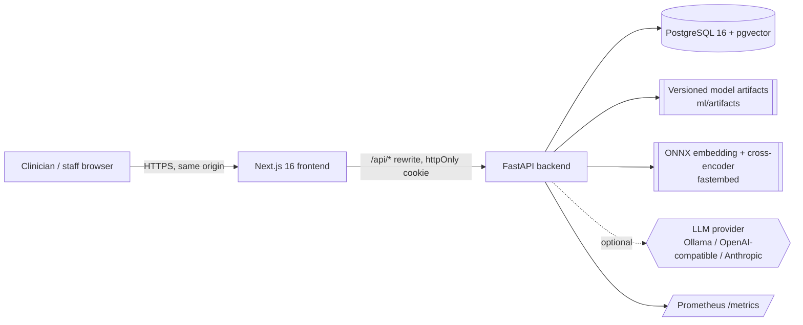
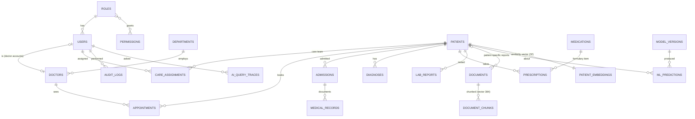
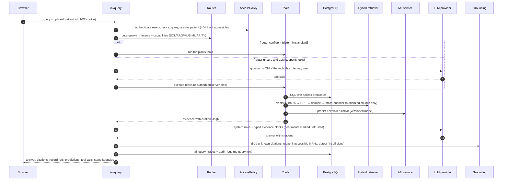
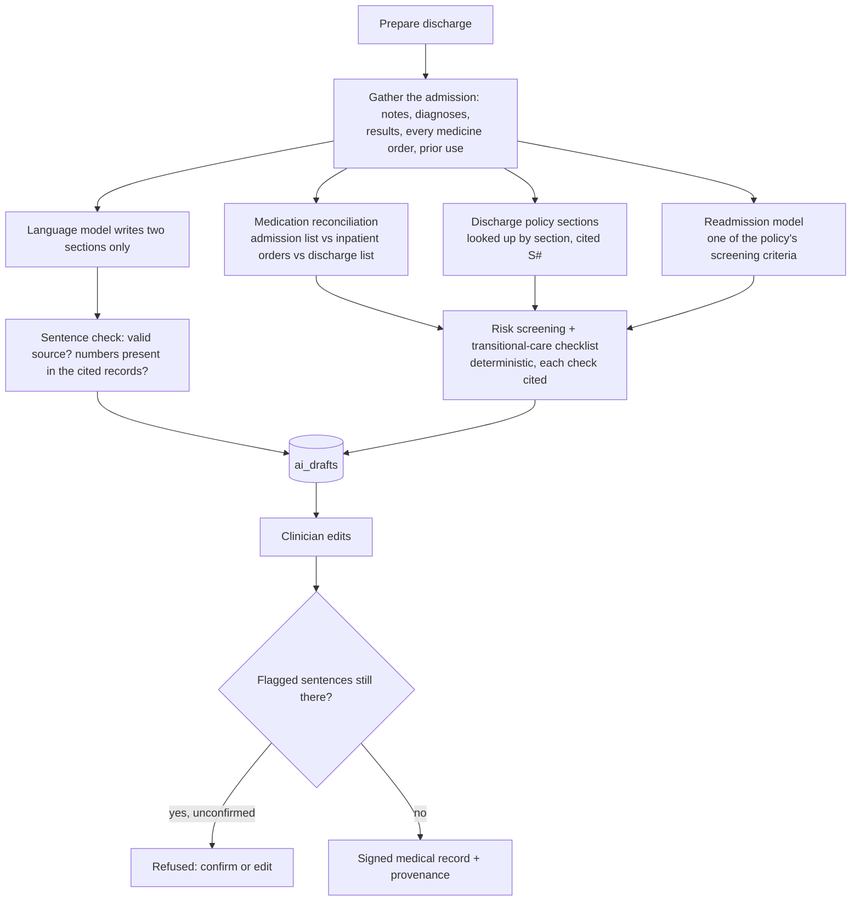
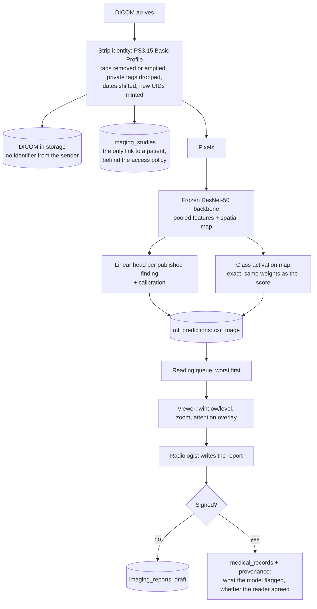

# CareFlow AI — Architecture

CareFlow AI is a **modular monolith**: one FastAPI service, one PostgreSQL database (with pgvector),
and one Next.js frontend. Each subsystem has a single responsibility:

| Subsystem | Responsibility | Never does |
|---|---|---|
| **PostgreSQL** | Source of truth for structured hospital data; also stores document chunks + embeddings (pgvector) and patient similarity vectors | — |
| **ML engine** (`app/ml`) | Readmission classification, length-of-stay regression, patient similarity, SHAP explanations | Decide access, generate text |
| **RAG engine** (`app/rag`) | Parse → chunk → embed → index documents; hybrid retrieval + reranking over *authorized* chunks | Answer questions by itself |
| **LLM layer** (`app/llm`) | Route, call authorized tools, synthesise grounded answers, validate citations | Decide what a user may see; touch the database directly |
| **Access policy** (`app/auth`) | RBAC permissions + row-level patient/document predicates composed into SQL | — |
| **Privacy gateway** (`app/privacy`) | Replace patient identifiers with placeholders before a prompt leaves the network; restore them in the answer and in tool arguments | Decide access; alter clinical values |
| **Clinical rules** (`app/services/news2.py`, `discharge.py`) | Scores and policy checks computed in code (NEWS2, discharge screening, medication reconciliation) | Ask a model what the rule says |
| **Interoperability** (`app/interop`) | Map the record to FHIR R4 resources for export | Widen what the caller may read |
| **Imaging** (`app/imaging`) | Read and de-identify DICOM, render films, score chest radiographs and localise what scored | Diagnose, or write a report |

## 1. System context



The browser only talks to the Next.js origin. `next.config.ts` rewrites `/api/*` to FastAPI, so the
session cookie can be `httpOnly` + `SameSite=Strict` and no token ever lives in JavaScript.

## 2. Backend module map

```
backend/app/
  api/            HTTP routers (thin): auth, patients, scheduling, clinical, vitals, imaging, discharge,
                  documents, ai, admin, fhir
  auth/           rbac.py (roles/permissions) · access.py (row-level SQL predicates) · dependencies.py
  audit/          audit log writer (own session: survives rolled-back requests)
  core/           config (pydantic-settings), security (argon2id, JWT), errors, logging, rate limiting
  db/ models/     SQLAlchemy 2.0 models + session; Alembic migrations in backend/alembic
  schemas/        Pydantic request/response models
  services/       timeline builder, appointment rules, similarity response, news2 (the published score),
                  vitals (recording + ward board), discharge (the co-pilot), policy_refs (link a check to its
                  policy section), events (in-process hub behind the server-sent-event stream)
  privacy/        pseudonymisation vault, the provider wrapper that applies it, and the name-finding pass
  imaging/        DICOM reading and de-identification, the frozen backbone, chest radiograph triage
  interop/        FHIR R4 resource mapping (ICD-10-CM, LOINC, UCUM, WHO ATC, SNOMED CT)
  ml/             feature_contract · features (DB→features) · registry · service (inference) · explain (SHAP) · similarity
  rag/            parsing · chunking · embeddings · bm25 · retrieval (hybrid) · reranking · ingestion · injection
  llm/            providers (Anthropic, OpenAI-compatible, extractive) · tools · evidence · prompts · orchestrator · grounding
  routing/        deterministic query router
  observability/  Prometheus metrics, request-context middleware, stage timer
  seed/           deterministic synthetic hospital generator
ml/               offline training + evaluation (UCI dataset) → ml/artifacts, ml/evaluation/reports
rag/              synthetic knowledge base (source → dist), benchmark + evaluation runner
```

*Deviation from the suggested layout:* retrieval/reranking/ingestion code lives in `backend/app/rag`
because it is runtime service code; the top-level `rag/` directory holds the corpus and the offline
evaluation. Likewise `ml/` holds offline training, while `backend/app/ml` holds inference. The
training code imports the **same feature contract** as inference, so the two cannot drift.

## 3. Data model



27 tables (`vital_signs` holds bedside observations with their NEWS2 score; `ai_drafts` holds a co-pilot
draft until a clinician signs it, after which `medical_records.ai_provenance` records who signed, which
model drafted, how much was edited and what each `[R#]`/`[S#]` marker in the text refers to;
`imaging_studies` holds one de-identified DICOM study each, with what was stripped from it and a link to
the triage prediction in `ml_predictions`, and `imaging_reports` holds the radiologist's report until they
sign it into `medical_records`). Enumerations are
`VARCHAR + CHECK` constraints (migration-friendly); timestamps are timezone-aware; foreign keys use
explicit `ON DELETE` behaviour; indexes cover every access path used by the API (patient/date composites,
statuses, HNSW indexes for both vector columns, and a **partial unique index** preventing a doctor from
being double-booked for live appointments).

## 4. The AI request pipeline



Key properties:

* **Authorization happens before the AI layer.** Tools receive the caller's `AccessPolicy`; the model
  can ask for anything but only ever receives rows the user could already see through the UI.
* **The deterministic path gives the LLM no tools at all** — it only writes prose over evidence. Tool
  calling is reserved for questions the router cannot classify.
* **Context budgeting.** Evidence is rendered within `CAREFLOW_LLM_CONTEXT_BUDGET_CHARS`; long record lists
  are clipped first, then fewer passages are included, and tool outputs in the agent loop are capped. Local
  servers such as Ollama default to a 4k-token window and silently drop the start of longer prompts — which
  is where the system rules live.
* **No LLM configured (or LLM down)?** The extractive composer answers from the same evidence
  (templates + verbatim, cross-encoder-selected sentences), so the system degrades instead of failing.

## 4a. The privacy gateway

Cloud models are convenient and are somebody else's computer. Every model call of a request goes through a
per-request gateway (`app/privacy/pseudonymize.py`) that:

1. builds a vault of the identifiers the database holds for the patients in the evidence — and only for
   patients the caller may access, so the replacement counts reveal nothing about anyone else;
2. replaces them in the outgoing prompt (name, MRN, date of birth, phone, e-mail, address, emergency
   contact), plus phone/e-mail/MRN/ID-shaped text the database does not hold, with stable placeholders
   (`PATIENT_1`, `MRN_1`, …);
3. runs a named-entity model (`app/privacy/ner.py`) over what is left and masks the people nobody ever
   issued an identifier for — a relative named in a note, a clinician at another hospital — as `PERSON_1`;
4. restores all of them in the answer **and in the model's tool-call arguments**, so a tool called with
   `MRN_1` runs against the real patient under the real access policy.

The order is deliberate: the deterministic pass is complete for the identifiers the system holds and cannot
miss one the way a tagger can, so it goes first and the statistical pass only sees what is left. This
hospital's own staff names are left alone (they are its directory, not patient identifiers), and clinical
dates, ages and values are left alone because a summary needs them: this is pseudonymisation, not
de-identification. The name model is `Xenova/bert-base-NER` (an ONNX export of dslim/bert-base-NER),
int8-quantised, loaded on first use, about 140 MB resident and a few hundred milliseconds for a full
prompt; with `CAREFLOW_PRIVACY_NER=false` the first two passes run alone and the answer says so rather than
claiming a pass that did not happen. The answer reports how many identifiers of which kinds were replaced
and can show the exact text the provider received; the trace stores the counts only.

## 4b. The discharge co-pilot



The division of labour is the point: values, doses, dates and rules come from the record and the policy;
the model writes prose and nothing else; the clinician is the only one who can put anything in the record.
Without a language model (or when it fails) the prose is assembled from templates over the same facts, so
the co-pilot still produces a complete, fully cited draft.

## 4c. Observations, NEWS2 and the live board

`app/services/news2.py` implements the published NEWS2 chart as a pure function: seven parameters banded and
summed, the single-parameter-3 rule, and the response and monitoring frequency for each band. The same
function scores seeded observations, the nurse's live preview and every saved set, so the number on the board
is always the one the chart defines. The hospital's own rapid-response criteria (Patient Safety Guidelines,
section 6) are applied separately and cite that section. "Overdue" is not invented either: it is the
monitoring frequency the score itself requires.

Recording an observation publishes an event to an in-process hub (`app/services/events.py`); each open
server-sent-event stream drops events for patients its viewer may not see, re-checks that access
periodically, and carries ids and the score only — the board itself is refetched through the ordinary
authorized endpoint. Streams end after `CAREFLOW_STREAM_MAX_SECONDS` (the browser reconnects), a process
serves a bounded number of them, and the board refreshes on a timer regardless, so the feature degrades to
polling wherever a proxy will not hold a stream open.

## 4d. FHIR export

`app/interop/fhir.py` maps the record to FHIR R4: Patient, Encounter, Condition (ICD-10-CM), Observation
(LOINC + UCUM, laboratory and vital signs), MedicationRequest (WHO ATC + SNOMED CT routes),
AllergyIntolerance, Appointment, DocumentReference, RiskAssessment (the readmission estimate), Practitioner
and Organization, returned as one searchset Bundle by `GET /fhir/Patient/{mrn}/$everything`. A signed
co-pilot summary also exports a `Provenance` with the clinician as `author` and the drafting model as an
`assembler` Device. Every resource carries `meta.security = HTEST` (test data). The same row-level policy
decides what the caller sees, errors are `OperationOutcome`, and tests validate every resource against the
`fhir.resources` models, check that every reference resolves inside the bundle, and check the codes for
elements whose bindings are required.

## 4e. Imaging: DICOM, triage and the reading queue



Three decisions carry this subsystem:

**De-identify on the way in, not on the way out.** A DICOM file's header is the classic imaging leak, so
the file written to storage keeps the pixels and the clinically meaningful tags (sex, age, view, body part,
window values) and nothing that identifies anyone. The **record** keeps the real acquisition date — a
clinician needs it, and the access policy already protects it; the **file** gets a date shifted by a
per-patient offset, so intervals between a patient's films survive and no real date does.

**The head is linear on frozen features, which makes the map exact.** The backbone is an ImageNet ResNet-50
that is never fine-tuned; each finding is a logistic regression on its 2048 pooled features. Because global
average pooling is linear, the class activation map is `w · f(x, y)` with the very weights the probability
uses — not an approximation of them (Zhou et al., CVPR 2016). The graph is loaded once with the pre-pool
activation exposed as a second output, so score and map come from a single forward pass.

**Only what survived a stated bar is shown.** Fourteen findings were modelled; eight met a bar fixed before
the test set was touched (ROC-AUC ≥ 0.70, bootstrap interval starting ≥ 0.65, ≥ 30 positive test films) and
the other six are reported in the model card and shown nowhere in the product. Each finding carries two
measured operating points — a rule-out cut-off at 90% sensitivity and an attention cut-off at 60% — so the
interface can say "not ruled out" where that is what the number means, and reserve "for attention" for the
higher one.

## 5. Query routing

A rule-based router (`app/routing/router.py`) maps question shapes to intents and a fixed tool plan:

| Example | Intent | Capabilities |
|---|---|---|
| "What is patient P1024's age?" | patient_fact | SQL |
| "What appointments does Dr. Rao have?" | appointments | SQL |
| "What does our diabetes guideline say?" | document_qa | RAG + LLM |
| "What is this patient's readmission risk?" | readmission_risk | SQL + ML |
| "Summarize this patient's history." | patient_summary | SQL + LLM |
| "Why is this patient's readmission risk high?" | explain_prediction | SQL + ML + LLM |
| "Compare the patient's treatment with our diabetes guideline." | guideline_comparison | SQL + RAG + LLM |
| "Find similar patients (and summarize…)" | similar_patients | SIMILARITY + SQL + LLM |

*Why deterministic first?* It is instant, free, testable (every row above is a unit test), immune to prompt
injection, and it keeps the expensive LLM call to one synthesis step. The LLM router adds value only for
the long tail of unusual phrasings, so that is the only place it is used.

## 6. Key design decisions

| Decision | Why | Trade-off |
|---|---|---|
| PostgreSQL + **pgvector** instead of a vector DB | One transactional store; access predicates and metadata filters are plain SQL joined to the vector search; no sync problems | Filtered HNSW can under-return at large scale (mitigated with `ef_search`; pgvector ≥0.8 iterative scans in the Docker image) |
| **In-process BM25** instead of Postgres FTS | `ts_rank` is not BM25 and stemming breaks identifiers (`MED-POL-004`, `HbA1c`, `P1024`) | Index held per worker, rebuilt on corpus change; fine for 10⁴–10⁵ chunks, beyond that use OpenSearch/pg_search |
| **RRF** for fusion | Cosine and BM25 scores are incomparable; rank fusion needs no calibration | Ignores score magnitudes |
| **fastembed (ONNX)** for embeddings + cross-encoder | Same models as sentence-transformers without PyTorch (~10× smaller image), CPU-friendly | Fewer model choices |
| **Sync SQLAlchemy** in FastAPI's threadpool | Simple, debuggable; ML/embedding work is CPU-bound anyway | Concurrency bounded by the pool; move LLM calls to async if concurrency grows |
| **BackgroundTasks** for ingestion | No broker/worker needed for a portfolio-scale system | Jobs die with the process; a restart leaves `processing` documents (re-index button). Production: a queue (Arq/Celery) |
| **Model artifacts on disk + registry table** | Versioned files are reproducible and reviewable; the DB mirrors model cards for joins with predictions | No remote model store (MLflow would be the next step) |
| **Extractive fallback provider** | The product must work without an API key and must never hallucinate when the LLM is down | Cannot reason or compare |
| **Dictionary pseudonymisation** instead of an NER model | The system knows its own identifiers exactly; deterministic, testable, no extra memory on a 512 MB host | Misses identifiers it never issued (a third party's name written into a note) |
| **Rules in code, cited to the policy** (discharge checks, NEWS2, rapid response) | A check that must be right every time should not depend on a model's mood; the citation lets a reader verify the rule | Rules can go stale: the draft compares the policy's indexed version with the one the checks were written for and says so |
| **One FHIR Observation per set of vital signs** | A bundle stays readable while each sign keeps its LOINC code as a component | Not the one-resource-per-sign shape of the US Core vital-signs profile |
| **In-process event hub for the live board** | No broker at demo scale; events carry ids only, and the board is refetched through the authorized endpoint | Single process only; a shared bus is needed for several instances |
| **Frozen image backbone + linear heads** instead of a fine-tuned CNN | Trains in minutes on a laptop, keeps inference at ~60 ms on CPU, and makes the activation map exact rather than approximated | About 0.05 less ROC-AUC than a fine-tuned DenseNet-121 of the CheXNet family; stated in the model card |
| **A publication bar for findings** | A score with a wide interval on 40 positive films is not a finding; the bar is arithmetic, fixed before the test set was read | Six findings are measured and never shown, so absence in the product means nothing |
| **De-identify DICOM on ingest** | The file is the thing that leaks; the database link is already protected by the access policy | The file loses provenance a hospital might want for reconciliation with the sending PACS |

## 7. Observability

* `RequestContextMiddleware`: request id (`X-Request-ID`), latency histogram per templated route, one JSON log line per request (no bodies, no PHI).
* `StageTimer`: per-AI-query latency for routing, tools, vector search, keyword search, fusion, rerank, ML inference, similarity, LLM and grounding.
* `ai_query_traces` table: route, routing method, provider/model, stage timings, retrieved and cited chunk ids, tool calls, model versions, token usage, status, how many identifiers were replaced before the prompt left the server — and a **hash** of the query instead of its text.
* Prometheus: `/metrics` (HTTP latency, AI stage latency, ML inference latency, context chunk counts, LLM tokens, degraded components).
* Admin UI: AI traces table and a metrics summary (p50/p95 by stage, route mix, denied events).

## 8. Deployment

`docker-compose.yml` runs three services: `db` (pgvector/pgvector:pg16), `backend` (runs `alembic upgrade
head`, an idempotent seed, then uvicorn; embedding and reranker models are baked into the image) and
`frontend` (Next.js standalone build). Local development without Docker uses `scripts/local_postgres.py`
(bundled PostgreSQL + pgvector binaries from the `pgserver` wheel).

## 9. Scaling path (not needed at demo scale)

1. Move ingestion and batch predictions to a job queue; run workers separately.
2. Swap in-memory BM25 for OpenSearch or ParadeDB `pg_search`; keep the retriever interface.
3. Serve the LLM asynchronously with streaming responses; add prompt caching for the stable system prompt.
4. Add read replicas for analytics queries; partition `audit_logs` and `ai_query_traces` by month.
5. Add MLflow (or similar) for model lineage; shadow-deploy new versions and compare predictions.
