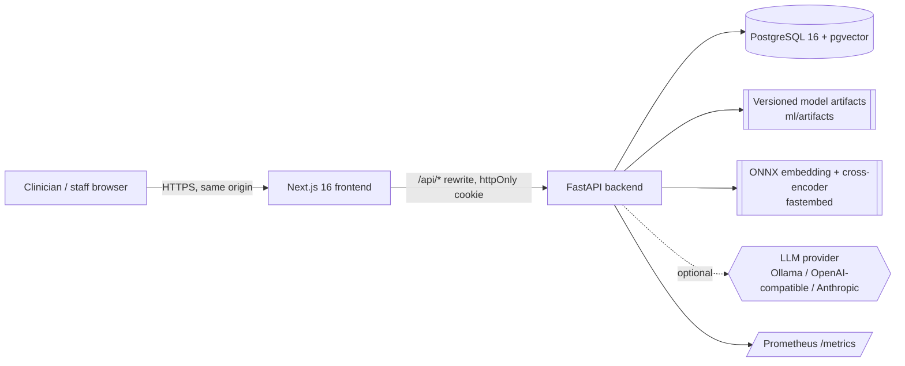
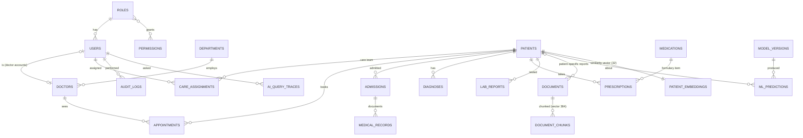
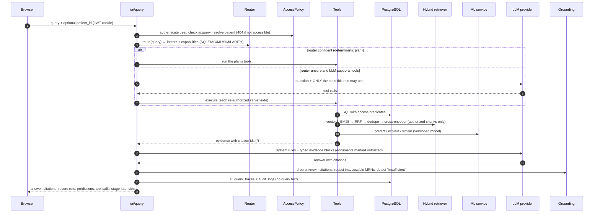

# CareFlow AI — Architecture

CareFlow AI is a **modular monolith**: one FastAPI service, one PostgreSQL database (with pgvector),
and one Next.js frontend. Each subsystem has a single responsibility:

| Subsystem | Responsibility | Never does |
|---|---|---|
| **PostgreSQL** | Source of truth for structured hospital data; also stores document chunks + embeddings (pgvector) and patient similarity vectors | — |
| **ML engine** (`app/ml`) | Readmission classification, length-of-stay regression, patient similarity, SHAP explanations | Decide access, generate text |
| **RAG engine** (`app/rag`) | Parse → chunk → embed → index documents; hybrid retrieval + reranking over *authorized* chunks | Answer questions by itself |
| **LLM layer** (`app/llm`) | Route, call authorized tools, synthesise grounded answers, validate citations | Decide what a user may see; touch the database directly |
| **Access policy** (`app/auth`) | RBAC permissions + row-level patient/document predicates composed into SQL | — |

## 1. System context



The browser only talks to the Next.js origin. `next.config.ts` rewrites `/api/*` to FastAPI, so the
session cookie can be `httpOnly` + `SameSite=Strict` and no token ever lives in JavaScript.

## 2. Backend module map

```
backend/app/
  api/            HTTP routers (thin): auth, patients, scheduling, clinical, documents, ai, admin
  auth/           rbac.py (roles/permissions) · access.py (row-level SQL predicates) · dependencies.py
  audit/          audit log writer (own session: survives rolled-back requests)
  core/           config (pydantic-settings), security (argon2id, JWT), errors, logging, rate limiting
  db/ models/     SQLAlchemy 2.0 models + session; Alembic migrations in backend/alembic
  schemas/        Pydantic request/response models
  services/       timeline builder, appointment rules, similarity response
  ml/             feature_contract · features (DB→features) · registry · service (inference) · explain (SHAP) · similarity
  rag/            parsing · chunking · embeddings · bm25 · retrieval (hybrid) · reranking · ingestion · injection
  llm/            providers (Anthropic, OpenAI-compatible, extractive) · tools · evidence · prompts · orchestrator · grounding
  routing/        deterministic query router
  observability/  Prometheus metrics, request-context middleware, stage timer
  seed/           deterministic synthetic hospital generator
ml/               offline training + evaluation (UCI dataset) → ml/artifacts, ml/evaluation/reports
rag/              synthetic knowledge base (source → dist), benchmark + evaluation runner
```

*Deviation from the suggested layout:* retrieval/reranking/ingestion code lives in `backend/app/rag`
because it is runtime service code; the top-level `rag/` directory holds the corpus and the offline
evaluation. Likewise `ml/` holds offline training, while `backend/app/ml` holds inference. The
training code imports the **same feature contract** as inference, so the two cannot drift.

## 3. Data model



23 tables, all created by a single Alembic migration (`backend/alembic/versions`). Enumerations are
`VARCHAR + CHECK` constraints (migration-friendly); timestamps are timezone-aware; foreign keys use
explicit `ON DELETE` behaviour; indexes cover every access path used by the API (patient/date composites,
statuses, HNSW indexes for both vector columns, and a **partial unique index** preventing a doctor from
being double-booked for live appointments).

## 4. The AI request pipeline



Key properties:

* **Authorization happens before the AI layer.** Tools receive the caller's `AccessPolicy`; the model
  can ask for anything but only ever receives rows the user could already see through the UI.
* **The deterministic path gives the LLM no tools at all** — it only writes prose over evidence. Tool
  calling is reserved for questions the router cannot classify.
* **Context budgeting.** Evidence is rendered within `CAREFLOW_LLM_CONTEXT_BUDGET_CHARS`; long record lists
  are clipped first, then fewer passages are included, and tool outputs in the agent loop are capped. Local
  servers such as Ollama default to a 4k-token window and silently drop the start of longer prompts — which
  is where the system rules live.
* **No LLM configured (or LLM down)?** The extractive composer answers from the same evidence
  (templates + verbatim, cross-encoder-selected sentences), so the system degrades instead of failing.

## 5. Query routing

A rule-based router (`app/routing/router.py`) maps question shapes to intents and a fixed tool plan:

| Example | Intent | Capabilities |
|---|---|---|
| "What is patient P1024's age?" | patient_fact | SQL |
| "What appointments does Dr. Rao have?" | appointments | SQL |
| "What does our diabetes guideline say?" | document_qa | RAG + LLM |
| "What is this patient's readmission risk?" | readmission_risk | SQL + ML |
| "Summarize this patient's history." | patient_summary | SQL + LLM |
| "Why is this patient's readmission risk high?" | explain_prediction | SQL + ML + LLM |
| "Compare the patient's treatment with our diabetes guideline." | guideline_comparison | SQL + RAG + LLM |
| "Find similar patients (and summarize…)" | similar_patients | SIMILARITY + SQL + LLM |

*Why deterministic first?* It is instant, free, testable (every row above is a unit test), immune to prompt
injection, and it keeps the expensive LLM call to one synthesis step. The LLM router adds value only for
the long tail of unusual phrasings, so that is the only place it is used.

## 6. Key design decisions

| Decision | Why | Trade-off |
|---|---|---|
| PostgreSQL + **pgvector** instead of a vector DB | One transactional store; access predicates and metadata filters are plain SQL joined to the vector search; no sync problems | Filtered HNSW can under-return at large scale (mitigated with `ef_search`; pgvector ≥0.8 iterative scans in the Docker image) |
| **In-process BM25** instead of Postgres FTS | `ts_rank` is not BM25 and stemming breaks identifiers (`MED-POL-004`, `HbA1c`, `P1024`) | Index held per worker, rebuilt on corpus change; fine for 10⁴–10⁵ chunks, beyond that use OpenSearch/pg_search |
| **RRF** for fusion | Cosine and BM25 scores are incomparable; rank fusion needs no calibration | Ignores score magnitudes |
| **fastembed (ONNX)** for embeddings + cross-encoder | Same models as sentence-transformers without PyTorch (~10× smaller image), CPU-friendly | Fewer model choices |
| **Sync SQLAlchemy** in FastAPI's threadpool | Simple, debuggable; ML/embedding work is CPU-bound anyway | Concurrency bounded by the pool; move LLM calls to async if concurrency grows |
| **BackgroundTasks** for ingestion | No broker/worker needed for a portfolio-scale system | Jobs die with the process; a restart leaves `processing` documents (re-index button). Production: a queue (Arq/Celery) |
| **Model artifacts on disk + registry table** | Versioned files are reproducible and reviewable; the DB mirrors model cards for joins with predictions | No remote model store (MLflow would be the next step) |
| **Extractive fallback provider** | The product must work without an API key and must never hallucinate when the LLM is down | Cannot reason or compare |

## 7. Observability

* `RequestContextMiddleware`: request id (`X-Request-ID`), latency histogram per templated route, one JSON log line per request (no bodies, no PHI).
* `StageTimer`: per-AI-query latency for routing, tools, vector search, keyword search, fusion, rerank, ML inference, similarity, LLM and grounding.
* `ai_query_traces` table: route, routing method, provider/model, stage timings, retrieved and cited chunk ids, tool calls, model versions, token usage, status — and a **hash** of the query instead of its text.
* Prometheus: `/metrics` (HTTP latency, AI stage latency, ML inference latency, context chunk counts, LLM tokens, degraded components).
* Admin UI: AI traces table and a metrics summary (p50/p95 by stage, route mix, denied events).

## 8. Deployment

`docker-compose.yml` runs three services: `db` (pgvector/pgvector:pg16), `backend` (runs `alembic upgrade
head`, an idempotent seed, then uvicorn; embedding and reranker models are baked into the image) and
`frontend` (Next.js standalone build). Local development without Docker uses `scripts/local_postgres.py`
(bundled PostgreSQL + pgvector binaries from the `pgserver` wheel).

## 9. Scaling path (not needed at demo scale)

1. Move ingestion and batch predictions to a job queue; run workers separately.
2. Swap in-memory BM25 for OpenSearch or ParadeDB `pg_search`; keep the retriever interface.
3. Serve the LLM asynchronously with streaming responses; add prompt caching for the stable system prompt.
4. Add read replicas for analytics queries; partition `audit_logs` and `ai_query_traces` by month.
5. Add MLflow (or similar) for model lineage; shadow-deploy new versions and compare predictions.
