# CareFlow AI — Machine Learning

> **What is not a model here.** NEWS2 (the early warning score), the discharge policy's readmission
> screening, the transitional-care checklist and the medication reconciliation are deterministic rules
> computed in code and cited to the chart or policy section they come from. They are described in
> [`architecture.md`](architecture.md#4c-observations-news2-and-the-live-board). The statistical models in
> the product are the four below and nothing else.

Four ML capabilities, all served through one inference layer (`backend/app/ml`) with versioned
artifacts, validated inputs, explanations and persisted predictions:

1. **30-day readmission risk** — binary classification, scored at (or near) discharge.
2. **Length of stay (LOS)** — regression, predicted at admission time.
3. **Patient similarity** — nearest neighbours over a structured clinical representation (pgvector).
4. **Chest radiograph triage** — multi-label classification over a frozen image backbone, used to order a
   reading queue and never to diagnose.

Every number in this document comes from `ml/evaluation/reports/*.md` / `ml/artifacts/*/metadata.json`,
generated by the training scripts. Nothing was typed in by hand.

## 1. Data

| | |
|---|---|
| Training data | **UCI "Diabetes 130-US hospitals for years 1999–2008"** (Strack et al., 2014), DOI 10.24432/C5230J, **CC BY 4.0** |
| Why | A real, public, fully de-identified readmission dataset with genuine class imbalance and genuine leakage traps — much more instructive than simulated labels |
| Size | 101,766 encounters of 71,518 (pseudonymous) patients; 99,340 used after exclusions |
| Exclusions | 2,423 encounters ending in death or hospice (readmission impossible → trivially negative labels would inflate metrics); 3 with invalid sex |
| Download | `python -m ml.data.download` (not redistributed in the repo); SHA-256 of the CSV is stored in every model card |
| Application data | The running hospital uses a **separate, fully synthetic** database (`backend/app/seed`). The models are applied to it through the feature contract below |

### The feature contract (bridging training and serving)

`backend/app/ml/feature_contract.py` defines, once, the columns, vocabularies and plausible ranges.
Training maps UCI columns into it (`ml/preprocessing/uci_diabetes.py`); inference maps database rows
into it (`backend/app/ml/features.py`). Preprocessing (median imputation, scaling, one-hot encoding with
the contract's fixed categories) lives *inside* the serialized sklearn `Pipeline`, so training/serving
skew cannot come from re-implemented transformations.

| Feature | UCI source | Hospital DB source |
|---|---|---|
| age_years | age decade midpoint | date of birth at admission |
| time_in_hospital | time_in_hospital | discharged_at − admitted_at |
| num_lab_procedures / num_medications | counts | lab reports / distinct medications linked to the admission |
| number_outpatient / emergency / inpatient | prior-year counts | completed visits, ED visits and admissions in the 365 days before admission |
| number_diagnoses | number_diagnoses | admission diagnoses + chronic problems |
| admission_type / source, discharge_disposition | ID mappings | admission columns |
| admitting_specialty | medical_specialty grouped | department |
| primary_diagnosis_category | ICD-9 chapter of diag_1 | primary diagnosis category |
| a1c_result / max_glucose | test categories | HbA1c / glucose results during the stay |
| insulin_regimen / medication_changed / on_diabetes_medication | medication columns | insulin orders and change reasons, diabetes drug classes |

Columns deliberately **not** used: `encounter_id`, `patient_nbr` (identifiers), `weight` (97% missing),
`payer_code` (not clinically meaningful and a fairness risk), race (no clinical justification for this use).

## 2. Readmission model

```mermaid
flowchart LR
    A[UCI CSV] --> B[clean + exclude expired/hospice]
    B --> C[contract features]
    C --> D[patient-grouped split 70/15/15]
    D --> E[baseline + 6 candidates]
    E --> F[select on validation PR-AUC]
    F --> G[isotonic calibration on validation]
    G --> H[F1-optimal threshold on validation]
    H --> I[evaluate ONCE on test]
    I --> J[artifact + model card + report]
```



**Class imbalance.** Prevalence of `<30`-day readmission is 11.4%. Each algorithm was trained both
unweighted and class-weighted (`class_weight="balanced"` / XGBoost `scale_pos_weight`). Selection uses
**validation PR-AUC**, which (unlike accuracy or ROC-AUC) is sensitive to performance on the rare class.
Weighting barely moved ranking metrics — expected, because re-weighting mostly shifts the score scale —
so the unweighted model (better calibrated) was kept, calibrated with isotonic regression on validation,
and the alert threshold chosen there to maximise F1.

**Candidates (validation → test):**

| Candidate | Val ROC-AUC | Val PR-AUC | Test ROC-AUC | Test PR-AUC | Test F1 |
|---|---|---|---|---|---|
| Logistic regression | 0.669 | 0.217 | 0.672 | 0.234 | 0.287 |
| Logistic regression (class-weighted) | 0.671 | 0.217 | 0.674 | 0.233 | 0.289 |
| **Random forest (selected)** | **0.679** | **0.231** | 0.686 | 0.253 | 0.305 |
| Random forest (class-weighted) | 0.679 | 0.228 | 0.682 | 0.243 | 0.297 |
| XGBoost | 0.676 | 0.228 | 0.683 | 0.253 | 0.299 |
| XGBoost (class-weighted) | 0.674 | 0.227 | 0.681 | 0.249 | 0.300 |
| Baseline (predict prevalence) | 0.500 | 0.110 | — | — | — |

(Per-candidate test numbers use each candidate's own validation threshold and uncalibrated scores; they
are shown for transparency and were not used for selection.)

**Selected model on the held-out test set** (15,108 encounters, prevalence 0.120, calibrated scores,
threshold 0.149):

| ROC-AUC | PR-AUC | Precision | Recall | F1 | Brier |
|---|---|---|---|---|---|
| 0.685 | 0.242 | 0.237 | 0.427 | 0.305 | 0.0995 |

Confusion matrix: TN 10,807 · FP 2,493 · FN 1,035 · TP 773. Calibration improved the Brier score
slightly (0.1000 → 0.0995).

**Interpretation.** Discrimination is moderate — consistent with published results on this dataset
(most readmissions are not predictable from administrative encounter data). PR-AUC is about 2.2× the
no-skill baseline. At the chosen threshold the model flags roughly one in four patients and catches 43%
of readmissions, with about one true readmission per four alerts. That trade-off suits *prioritising*
follow-up calls, not autonomous decisions — which is how the UI and discharge policy present it.

**Risk bands.** `low` < training base rate (11.3%) ≤ `moderate` < 2× base rate (22.6%) ≤ `high`. Bands
relative to the base rate are easier to explain than raw probabilities ("about twice the average").

### Leakage prevention

* **Grouped splitting by patient**: all encounters of a patient fall in one partition (asserted in code).
* **Exclusion of death/hospice discharges**, whose label is known by construction.
* **Timing**: readmission is scored at discharge, so stay-level features are legitimately available.
* **Ablation** — the same model trained on a naive row split:

  | Split | Test ROC-AUC | Test PR-AUC |
  |---|---|---|
  | Grouped by patient (deployed) | 0.685 | 0.242 |
  | Naive row split | 0.668 | 0.233 |

  Honest reading: on this dataset the naive split did **not** inflate metrics (it is slightly lower,
  within split-to-split noise). Prior utilisation features already summarise a patient's history, and
  most patients have one encounter, so memorisation has little to exploit here. Grouped splitting remains
  the correct protocol — it is what guarantees the test set measures generalisation to new patients.

### Explanations (SHAP)

* Random forest → `shap.TreeExplainer` (exact TreeSHAP, cached per loaded model); XGBoost → native
  `pred_contribs`; linear models → exact linear SHAP. Attributions on one-hot columns are **summed back
  to the original feature**, so "admission source" gets one number.
* Additivity is tested: Σ contributions + base value equals the model's raw probability (`test_ml.py`).
* The UI and the assistant always phrase factors as *"X contributed toward a higher predicted risk"* —
  never causation. SHAP explains the model, not the patient.
* Global importance (mean |SHAP| on test): prior-year inpatient admissions 0.023, discharge destination
  0.018, insulin regimen 0.005, number of diagnoses 0.005, emergency visits 0.004, …
* A notable association the model learned: a measured HbA1c > 8% *lowers* predicted risk. This mirrors
  the original paper's finding (measuring HbA1c correlated with lower readmission) and is a good example
  of why attributions must not be read causally.

### Serving caveats (shown to users)

* The model was trained on **diabetic** inpatients; non-diabetic patients are flagged as outside the training population.
* For a patient who is still admitted, stay length, labs and discharge destination are provisional (the model expects completed stays); a note says so.
* Distribution shift: the synthetic hospital measures glucose and outpatient visits far more often than the 1999–2008 data did.

## 3. Length-of-stay model

Predicted **at admission**, so only admission-time features are allowed (age, sex, admission
type/source, admitting specialty, primary diagnosis group, prior-year utilisation). Anything measured
during the stay is excluded as target leakage.

| Model (test) | MAE (days) | RMSE (days) | R² |
|---|---|---|---|
| **XGBoost (selected, validation MAE 2.228)** | **2.246** | **2.883** | **0.078** |
| Random forest (validation) | 2.235 | 2.864 | 0.072 |
| Ridge (validation) | 2.273 | 2.906 | 0.045 |
| Baseline: predict median | 2.279 | 3.031 | −0.019 |

**Prediction interval:** empirical 10th–90th percentile of validation residuals (−2.97 / +4.15 days);
observed test coverage 79.9% against an 80% target.

**Leakage ablation:**

| Features | Test MAE | Test R² |
|---|---|---|
| Admission-time (deployed) | 2.246 | 0.078 |
| + lab/medication/procedure counts and discharge-coded diagnoses | 1.733 | 0.413 |

The leaky variant looks five times better offline — and would be useless at admission, when those
counts do not exist yet. This is the clearest leakage lesson in the project. The deployed model is
honest but weak; the UI shows the interval, the error, and labels it an operational estimate.

## 4. Patient similarity

**Representation (`sim-v1`, 32 dimensions)** — `backend/app/ml/similarity.py`

| Block | Dims | Encoding | Weight |
|---|---|---|---|
| Numeric: age, admissions (2y), ED visits (2y), mean LOS, active medications, chronic conditions, last HbA1c, last eGFR | 8 | z-score against **fixed reference scales**, clipped ±3; missing → reference mean (0) | 0.5 |
| Diagnosis categories (chronic/active or last 2 years) | 9 | multi-hot | 1.0 |
| Medication groups (active outpatient) | 12 | multi-hot | 0.6 |
| Sex | 2 | one-hot | 0.3 |
| Paediatric flag (age < 18) | 1 | binary | 1.5 |

* Fixed reference scales (not dataset statistics) mean a stored vector never changes because other patients were added.
* Weights encode clinical judgement: shared problems matter most, current treatment next, demographics least; children should practically never match adults.
* **Metric:** cosine similarity, served by pgvector (`<=>`, HNSW index). Cosine on centred/weighted features compares the *profile shape* rather than magnitudes.
* **Retrieval:** the query patient's vector is recomputed on each request (fresh data); candidates are restricted **in SQL** to patients the user may access; `hnsw.ef_search` is raised so filtering does not starve the result list; self is excluded.
* **Output:** neighbours with shared diagnosis/medication groups plus descriptive cohort patterns (30-day readmission rate, mean LOS, common diagnoses/medications) — explicitly *not* a prediction.

**Validation** (no ground-truth "similar" labels exist, so proxies are used; `ml/evaluation/evaluate_similarity.py`, 240 synthetic patients, k = 5):

| Variant | Department agreement@5 | Diagnosis Jaccard | Neighbour readmit rate (patient readmitted) | (not readmitted) |
|---|---|---|---|---|
| **Weighted cosine (deployed)** | **0.870** | **0.913** | 0.308 | 0.109 |
| Unweighted cosine | 0.780 | 0.782 | 0.426 | 0.101 |
| Weighted Euclidean | 0.877 | 0.918 | 0.251 | 0.092 |
| Random baseline | 0.305 | 0.350 | 0.139 | 0.152 |

Reading: neighbours are clinically coherent (≈3× random agreement), and patients who were readmitted
have neighbours who were readmitted much more often (outcome concordance — readmission itself is not
in the representation, although utilisation is, which is a caveat). Weighting trades a little outcome
concordance for markedly better clinical coherence. These are synthetic-data proxies, not clinical validation.

## 5. Chest radiograph triage

The only model in the product that reads pixels. It exists to put a reading queue in a sensible order and
to offer a second look; it does not diagnose, it does not write the report, and the report is written and
signed by a clinician (`docs/architecture.md` §4e).

**Data.** NIH ChestX-ray14 (Wang et al., CVPR 2017), 31 shards of the public release: 37,339 frontal films
from 16,170 patients. Labels were NLP-mined from radiology reports and are about 90% accurate by the
authors' own estimate, which caps how good any model fitted on them can look and is the first limitation in
the card. Split **by patient** 70/10/20 — two films of the same chest are not independent samples — giving
26,122 train / 3,668 validation / 7,549 test films. Films with an implausible age (the release contains a
few of 148 and 411) are dropped.

**Architecture and why.** A frozen ImageNet ResNet-50 (ONNX, `Qdrant/resnet50-onnx`) turns a film into 2048
numbers; one logistic regression per finding sits on top, with regularisation chosen on validation ROC-AUC
and probabilities calibrated on validation (isotonic where there are at least 100 positives, Platt
otherwise). Training all fifteen heads takes seconds once features are extracted, inference is ~60 ms on
CPU, and — because global average pooling is linear — the class activation map is exactly `w · f(x, y)`
with the same weights the probability uses, rather than a gradient approximation of them.

Measured alternatives before settling: 320×320 and 384×384 inputs (0.721 and 0.694 mean ROC-AUC against
0.719 at 224×224 on a pilot slice, so the cheapest won), and concatenating max-pooled with average-pooled
features (no gain). The one change that would clearly help is fine-tuning the backbone, worth roughly 0.05
ROC-AUC judging by the CheXNet family; it is stated in the card rather than quietly skipped.

**Operating points.** Two per finding, both set on validation and both reported with what they achieved on
test: a **rule-out** cut-off at 90% sensitivity and an **attention** cut-off at 60%. The interface uses the
wording the numbers support — "not ruled out" above the first, "for attention" above the second.

**Publication bar (fixed before the test set was read).** A finding is shown in the product only with
ROC-AUC ≥ 0.70, the lower end of its 95% bootstrap interval ≥ 0.65, and ≥ 30 positive test films. Eight of
fourteen passed; the six that did not (Fibrosis 0.678, Pleural thickening 0.675, Infiltration 0.644, Mass
0.634, Pneumonia 0.625, Nodule 0.587) are reported in the card and shown nowhere else — so the absence of a
finding in this tool means nothing about whether it is on the film.

| Finding | Positives | ROC-AUC | 95% CI | PR-AUC | Sens | Spec | Age/sex/view only |
|---|---|---|---|---|---|---|---|
| Pulmonary oedema | 145 | 0.800 | 0.766–0.834 | 0.080 | 0.83 | 0.59 | 0.747 |
| Emphysema | 162 | 0.792 | 0.755–0.827 | 0.100 | 0.90 | 0.39 | 0.550 |
| Pleural effusion | 823 | 0.779 | 0.763–0.794 | 0.287 | 0.87 | 0.51 | 0.607 |
| Pneumothorax | 338 | 0.763 | 0.737–0.786 | 0.148 | 0.93 | 0.34 | 0.565 |
| Cardiomegaly | 182 | 0.726 | 0.685–0.761 | 0.094 | 0.95 | 0.18 | 0.562 |
| Consolidation | 300 | 0.712 | 0.685–0.737 | 0.076 | 0.95 | 0.21 | 0.645 |
| Any finding | 3,477 | 0.708 | 0.697–0.719 | 0.644 | 0.91 | 0.28 | 0.590 |
| Atelectasis | 774 | 0.708 | 0.691–0.724 | 0.196 | 0.92 | 0.33 | 0.611 |

**The last column is the point.** It is a logistic regression on age, sex and view position with no image
at all. Portable AP films come from sicker patients, so a model can score them well for reasons that have
nothing to do with the chest; a finding whose image model barely beats that baseline is not reading the
film. It is the imaging equivalent of the leakage ablation in §2.

**Subgroups.** The card reports accuracy separately by sex, view (PA vs AP) and age band for every
published finding, because one aggregate number hides exactly the failure that matters.

**Feedback loop.** When a radiologist signs a report they answer whether the model's flags matched their
read (agreed / partly / disagreed / not used). That answer is stored with the report and is the only honest
measure of the model once a film is no longer a test-set film.

## 6. Inference service & model versioning

* **Artifacts:** `ml/artifacts/<model>/<version>/{model.joblib, metadata.json}` + `registry.json` (active version per model). The model card records dataset hash, split, feature configuration, candidates, metrics, calibration, thresholds, importance, ablations, environment versions and limitations.
* **Registry** (`app/ml/registry.py`): callers ask for a model by *name*; the active version is configuration. Artifacts are loaded lazily, cached, and mirrored into the `model_versions` table at startup.
* **Predictions** are persisted in `ml_predictions` with model version, admission, inputs and explanation; identical requests within 24 h reuse the stored row instead of duplicating it.
* **Errors:** missing/corrupt artifacts → 503 with an actionable message; invalid features → 422; no admission on record → `status: not_applicable`.
* **Latency (measured end-to-end through the API on a laptop CPU, warm):** readmission incl. SHAP
  0.19–0.35 s (TreeSHAP over 300 random-forest trees dominates — XGBoost's native contributions would be
  ~10× faster if latency mattered more than the ~0.003 PR-AUC difference); length of stay 27–54 ms;
  similarity search 17–35 ms; timeline 15–20 ms.

## 7. Reproduce

```bash
uv run --project backend python -m ml.data.download
uv run --project backend python -m ml.training.train_readmission --version 1.0.1
uv run --project backend python -m ml.training.train_los --version 1.0.1
uv run --project backend python -m ml.evaluation.evaluate_similarity   # needs a seeded database
```

The imaging model has its own pipeline, because extracting features from 37,000 films is the slow part and
is cached so that re-fitting a head afterwards takes seconds:

```bash
uv run --project backend python -m ml.data.download_cxr --train 24 --test 7
uv run --project backend python -m ml.preprocessing.nih_cxr
uv run --project backend python -m ml.training.train_cxr_triage --version 1.0.1
uv run --project backend python -m ml.data.build_demo_studies      # the 24 films that ship with the repo
```

New versions are written next to old ones and `registry.json` is pointed at them; old artifacts stay
available for rollback and for explaining historical predictions.

## 8. What to know for an interview

* **Why PR-AUC for selection?** With 11% positives, ROC-AUC is dominated by the easy negatives; PR-AUC shows how precise the alerts are at useful recall.
* **Why calibrate?** Risk is shown as a probability and compared to bands; isotonic calibration makes "20%" mean ~20% observed. Class weighting distorts probabilities, so it was not used for the served model.
* **How did you choose the threshold?** On validation (never test), maximising F1 on calibrated scores; in a real deployment it would be set with clinicians from the cost of a missed readmission versus a follow-up call.
* **Leakage you avoided:** repeated patients across splits, labels determined by death/hospice, stay-time features in an admission-time model (shown quantitatively).
* **Why a random forest?** Best validation PR-AUC by a small margin; XGBoost was within noise. A logistic regression is 1–2 points worse and more transparent — a defensible choice if interpretability outweighed accuracy.
* **Limits:** 1999–2008 US diabetic inpatients, administrative features only, synthetic serving population, no fairness audit across subgroups (next step: per-group calibration and error rates — the chest radiograph card already does this by sex, age band and view).
* **Why a linear head on frozen image features?** It trains in seconds, serves in ~60 ms, and makes the activation map exact rather than approximate. The cost — about 0.05 ROC-AUC against a fine-tuned DenseNet-121 — is stated in the card, which is the difference between a trade-off and an omission.
* **How do you stop a weak finding from being shown?** A bar fixed before the test set was read: six of fourteen findings are measured, reported, and never displayed.
