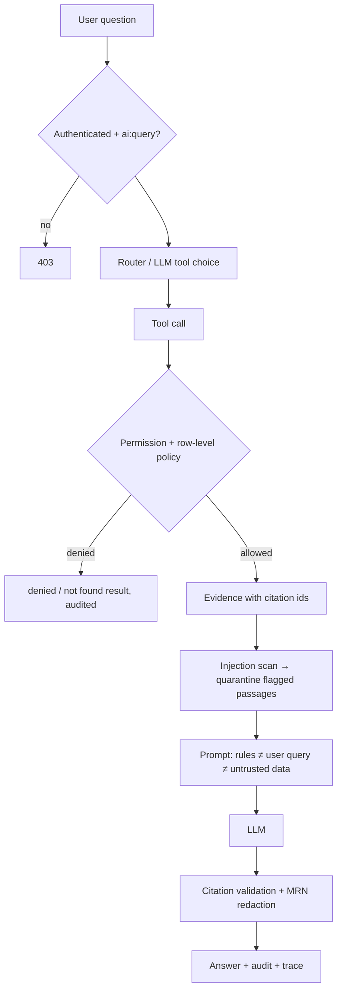

# CareFlow AI — Security

> Portfolio system on synthetic data. The controls below are real and tested, but the deployment has
> not been through a formal security assessment and is not intended to hold real patient data.

## 1. Threat model (what we defend against)

| Threat | Example | Primary controls |
|---|---|---|
| Unauthenticated access | Calling the API without a session | JWT on every route, 401 by default |
| Horizontal privilege escalation | A doctor opening a patient outside their care | Row-level SQL predicates, 404 for "not accessible" |
| Vertical privilege escalation | A receptionist reading clinical notes | Permission checks per endpoint and per AI tool |
| Data exfiltration through the AI | "List every patient with diabetes" | Tools run with the caller's policy; the LLM never has DB access |
| Prompt injection in documents | A PDF saying "ignore previous instructions…" | Scanner + quarantine, data-only delimiters, tool authorization, citation validation |
| Credential attacks | Password spraying | Argon2id, generic errors, rate limiting, timing-safe unknown-user path |
| CSRF | A malicious site POSTing with the user's cookie | `SameSite=Strict` cookie + mandatory custom header on writes |
| Malicious uploads | Executables, oversized files, path traversal | Extension allow-list + magic-byte check, size limit, sanitised filenames, server-generated paths |
| Information leakage | Stack traces, PHI echoed in validation errors | Structured error envelope, validation errors report field + reason only |

## 2. Authentication

* **Passwords:** Argon2id (`argon2-cffi` defaults). Unknown emails verify against a dummy hash so response time does not reveal account existence.
* **Tokens:** HS256 JWT with `sub`, `role`, `iat`, `exp`, `jti`; 60-minute lifetime; secret from `CAREFLOW_JWT_SECRET` (startup refuses secrets shorter than 32 characters outside tests). The user row is reloaded on every request, so deactivation and role changes take effect immediately.
* **Browser sessions:** the token is set as an `httpOnly`, `SameSite=Strict` cookie (`Secure` when `CAREFLOW_COOKIE_SECURE=true`). JavaScript never sees it. API clients may send `Authorization: Bearer`.
* **CSRF:** cookie-authenticated `POST/PATCH/DELETE` must carry `X-CareFlow-CSRF: 1`; browsers cannot add custom headers cross-site without a CORS preflight, which the CORS policy (explicit origins) rejects.
* **Brute force:** 5 failed logins per IP+email per 15 minutes → HTTP 429 (`core/ratelimit.py`). Failures are audited with a hashed email reference.

## 3. Authorization

Two layers, both server-side:

1. **RBAC permissions** (`auth/rbac.py`) — coarse capabilities checked by the `require(...)` dependency.
   ADMIN has all; DOCTOR clinical + ML + prescribing; NURSE clinical read/write for assigned patients, no ML or prescribing; RECEPTIONIST demographics and scheduling only.
2. **Row-level access** (`auth/access.py`) — *which* patients and documents. Predicates are composed into
   the SQL of every query, including vector search, BM25 candidate sets and similarity search:
   * DOCTOR: care-team assignment, patient's primary department, admission to the department, or an appointment with the doctor.
   * NURSE: active care-team assignment only.
   * Documents: role → allowed access scopes (`all_staff`, `clinical`, `admin`); patient-specific documents additionally require clinical access to that patient.

A patient that exists but is not accessible returns the same **404** as a missing id, so identifiers cannot be enumerated; the denial is still written to the audit log.

## 4. AI-specific controls

* **Authorization before retrieval, not after generation.** The model is never trusted to filter data.
* **Tools are role-filtered** — a receptionist's model is not even offered clinical tools — and each call is re-checked.
* **Prompt construction** separates the system prompt, the user query (`<user_query>`), authorized database facts, predictions and retrieved documents (`<retrieved_documents trust="untrusted">`). Retrieved text is neutralised so it cannot forge or close these delimiters.
* **Prompt-injection scanner** (`rag/injection.py`) flags override/role-play/exfiltration/fake-tag/tool-invocation patterns at ingestion. Flagged chunks are visible to administrators but **quarantined** from the LLM context by default, and the user is told a passage was withheld.
* **Output checks:** citations must reference evidence that was actually supplied; patient identifiers the user cannot access are redacted.
* **Clinical-safety rules** in the system prompt: no diagnosis, treatment selection or patient-specific dosing; model factors described as associations, never causes. Decision-style questions are flagged by the router and answered with a safety notice.
* **Tests:** `backend/tests/test_injection.py` covers the scanner, delimiter neutralisation, quarantine, an LLM that *obeys* an injection and tries to read an unauthorized patient (blocked), fabricated citations (removed) and identifier redaction.

## 5. Input validation & error handling

* Pydantic models with lengths, patterns, ranges and enums for every request body; query parameters are typed and bounded.
* ML inputs are validated against the feature contract (unknown features, categories and implausible ranges are rejected, not clipped).
* Error envelope: `{"error": {"code", "message", "request_id", "details"}}`. Unhandled exceptions return a generic 500 with the request id; the traceback goes to the server log only. Validation errors list field names and reasons but never echo submitted values.

## 6. File uploads

Allow-listed extensions (`.pdf .txt .md .docx`), magic-byte checks for PDF/DOCX, 20 MB limit (read with a bounded buffer), filenames reduced to a safe character set, storage paths generated server-side (`<doc_key>/v<n>/<file>`), SHA-256 recorded for integrity and duplicate detection. Parsing runs in a background task; failures mark the document `failed` with a safe message.

## 7. Secrets & configuration

No secrets in source. All configuration comes from environment variables (`.env.example` documents every one). `.env` files are git-ignored. The seed's demo password comes from `CAREFLOW_DEMO_PASSWORD`. Docker Compose refuses to start without `POSTGRES_PASSWORD`.

## 8. Audit logging

Written through a separate session so denied or failed requests are still recorded. Logged actions include logins (success/failure/blocked), patient reads, clinical sub-resource reads, record/prescription/lab/admission writes, appointment changes, document upload/read/download/delete, source inspection, ML predictions, similarity queries, AI queries, AI tool denials, role and care-team changes. Entries hold ids, role, outcome, request id and IP — the writer strips keys such as `query`, `text`, `notes`, `content` and `password` from details. AI traces store a SHA-256 of the question, never the text.

## 9. HTTP hardening

`X-Content-Type-Options: nosniff`, `X-Frame-Options: DENY`, `Referrer-Policy: no-referrer`, `Cache-Control: no-store` on API responses, explicit CORS origins with credentials, containers run as non-root users.

## 10. Known gaps (deliberately out of scope)

* No MFA, SSO/OIDC, password reset flow or refresh-token rotation; no server-side token revocation list (short expiry instead).
* Rate limiter is per process (move to Redis for multiple instances).
* `/metrics` is unauthenticated — restrict at the network layer in production.
* HS256 shared secret; asymmetric keys (RS256/EdDSA) would allow verification without the signing key.
* No field-level encryption or row-level security in PostgreSQL itself (authorization is enforced in the application layer).
* Heuristic injection detection can be evaded; the architecture limits the blast radius (authorization, no DB access for the model) rather than relying on detection.
* "Break-glass" emergency access is not implemented.
